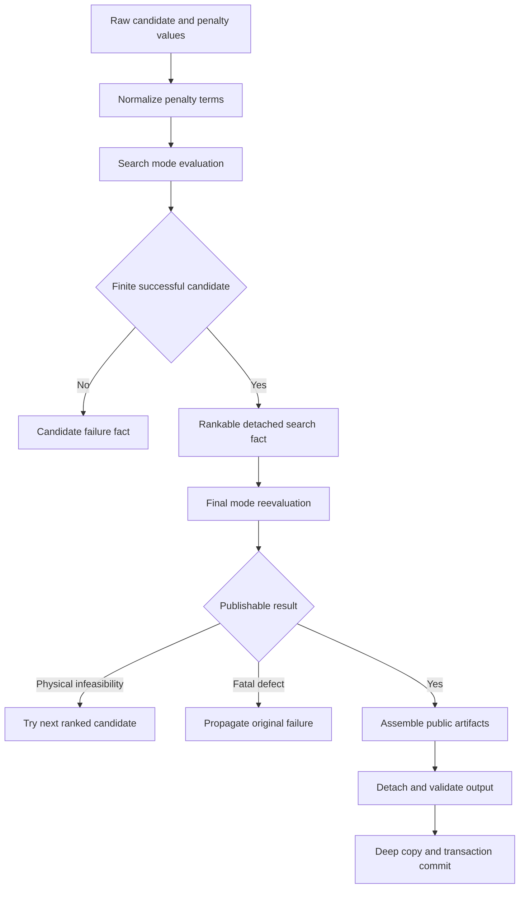
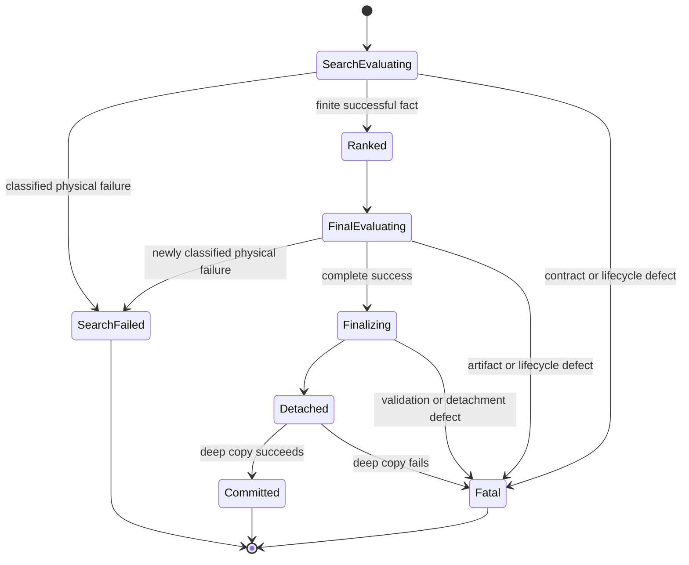

# Unit 1 Business Logic Model

## Scope

Unit 1 defines the pure transformations and public-boundary behavior for
candidate correctness and detached HPR results. It does not select CoolProp
fluids, run global search, expose public budget parameters, or solve direct
process-MVR stages.

## Processing Model

**Text alternative**: Raw candidate penalties are normalized before a
lightweight search evaluation. A finite success becomes a rankable detached
fact. A selected candidate is reevaluated in final mode. Newly classified
physical infeasibility permits the next candidate; contract, lifecycle,
artifact, and detachment defects propagate. A successful final result is
assembled, detached, validated, deep-copied, and committed.

## Algorithm 1: Penalty Normalization

### Input

One documented penalty value from a cycle, allocation, or topology objective:

- a real numeric scalar;
- a rectangular numeric array-like value of any rank;
- an empty numeric array-like value.

Boolean values are not accepted as numeric penalties.

### Transformation

1. Reject a scalar boolean or any boolean element.
2. Convert the complete input to a numeric floating array without object dtype.
3. If conversion exposes ragged structure, non-numeric data, or an object array,
   raise a fatal penalty-contract error.
4. Flatten the array in stable row-major order.
5. If the flattened array is empty, return an empty immutable tuple.
6. Reject the complete input when any term is NaN or positive/negative infinity.
7. Return an immutable tuple of Python floats.
8. The accounting function clips each normalized term at zero and applies the
   configured shared penalty function. Normalization itself does not change the
   sign or magnitude of a finite term.

### Output

An immutable one-dimensional tuple of finite floats. Empty means no penalty
terms and therefore a zero feasibility penalty.

### Required behavioral examples

| Input | Normalized terms | Result |
|---|---|---|
| `2.0` | `(2.0,)` | valid |
| `[]` | `()` | valid; zero terms |
| `[2.0]` | `(2.0,)` | valid |
| `[[1.0, 2.0], [3.0, 4.0]]` | `(1.0, 2.0, 3.0, 4.0)` | valid |
| `[[1.0], [2.0, 3.0]]` | none | fatal ragged-shape error |
| `[1.0, NaN]` | none | fatal non-finite error |
| `True` | none | fatal type error |

This rule fixes the observed `[hp.penalty]` two-dimensional shape without
special-casing cascade or parallel topology.

## Algorithm 2: Search-Mode Candidate Evaluation

### Preconditions

- the candidate vector has already passed layout/bounds preparation;
- the objective obeys the `HPRBackendResult` contract;
- the evaluation mode is explicitly `search`.

### Steps

1. Parse the candidate vector into topology state.
2. Solve only the thermodynamic and allocation facts required to decide success
   and compute the scalar objective.
3. Normalize every penalty source through Algorithm 1 before shared accounting.
4. Return a typed backend result with:
   - finite scalar objective for a successful candidate;
   - success state and scalar work/utility/accounting facts;
   - no live model;
   - no debug figure;
   - no public stream/cascade construction unless the scalar objective
     mathematically requires that data;
   - no public simulation record;
   - a stable failure fact for a classified physical infeasibility.
5. Malformed result types, penalty contracts, and lifecycle defects propagate;
   they are not mapped to a failed candidate.

### Search fact invariant

A successful search fact is sufficient to rank the point but is never directly
published. It is immutable for the duration of one solve and contains no engine
object.

## Algorithm 3: Final-Mode Candidate Evaluation

### Preconditions

- the candidate was selected from ranked finite search facts;
- the evaluation mode is explicitly `final`.

### Steps

1. Reevaluate the point using the same thermodynamic equations and normalized
   penalty semantics as search mode.
2. Construct complete streams, cascade inputs, economics, arrays, and nominal
   simulation evidence only for this final evaluation.
3. If reevaluation yields a newly classified physical infeasibility, record the
   candidate-local outcome and permit the caller to try the next ranked point.
4. If artifact construction, result validation, engine lifecycle, or detachment
   fails, propagate the original exception with its cause.
5. For a successful simulated topology, require a canonical detached simulation
   record before finalization.
6. Pass the complete internal result to Algorithm 4.

### Search/final consistency rule

For identical inputs and engine conditions, a search-mode success and final-mode
success must have equivalent objective, success state, and core numerical facts
within the declared numerical tolerance. Final mode may add artifacts; it may
not silently change the objective formula.

## Algorithm 4: Public Result Finalization

1. Require `success=True`, finite objective/accounting values, and complete
   public stream collections.
2. For a simulated CoolProp or TESPy target, require a detached generalized
   simulation record.
3. Recursively finalize every nested period output before aggregating or
   publishing the parent.
4. Build output fields from approved detached data only.
5. Never copy `HPRThermoArtifacts.model` or `debug_figure` to output fields.
6. Explicitly set `HeatPumpTargetOutputs.model=None`.
7. Traverse the complete output object graph and reject:
   - CoolProp state/cycle instances;
   - TESPy network/component instances;
   - callable closures, open resources, and debug figures;
   - arbitrary exception objects;
   - an internal `HPRThermoArtifacts` container.
8. Validate the public Pydantic model.
9. Return the detached output to the existing application transaction.
10. The transaction performs its existing deep copy before commit; failure to
    copy is fatal and leaves application state unchanged.

### Recursive traversal

Traversal follows Pydantic fields, mappings, sequences, NumPy arrays, existing
detached `Value` and stream/domain records, and period-output containers. It
uses object identity tracking to avoid infinite loops. Unknown arbitrary types
at the public boundary fail closed.

## Algorithm 5: Generalized Simulation Evidence

1. Identify the accepted topology using a closed topology identifier.
2. Preserve the current single-stage nominal fields for compatible existing
   consumers.
3. Create an ordered loop record for every VC or MVR loop.
4. Create ordered stage records within each loop, including stage role, fluid,
   nominal evaporating/condensing or suction/discharge states, efficiencies,
   duty/work facts, and power boundary.
5. Store only finite primitive values, immutable tuples, and bounded JSON-safe
   assumptions.
6. Retain backend, engine version, mode, period identifier, and declared
   compressor-only power boundary.
7. Reject missing, duplicate, unordered, or topology-inconsistent loop/stage
   evidence.

The record is evidence of the accepted nominal design, not a replayable engine
session and not a substitute for complete target streams.

## Algorithm 6: Foundational Contract Validation

### Search budget

- `maximum_iterations` and `maximum_evaluations` are positive integers;
- booleans, fractional numbers, zero, negative values, NaN, and infinity fail;
- defaults are 300 and 1,000,000 respectively;
- the budget is immutable and engine-neutral.

### Failure diagnostic

- category belongs to the closed enum;
- reason code belongs to the stable OpenPinch vocabulary;
- summary is sanitized and length-bounded;
- fluid, stage, period, and candidate context are optional detached values;
- raw exception objects, raw tracebacks, and unbounded property-engine messages
  are prohibited.

### Failure summary and targeting error

- counts are non-negative and reconcile with evaluated outcomes;
- representative diagnostics are capped;
- the summary is immutable and detached;
- `HPRTargetingError` remains catchable as `ValueError`;
- Unit 1 defines the contract, while Unit 2 owns runtime accumulation and raise
  policy.

## State and Transaction Model

**Text alternative**: Search evaluation either yields a local physical failure,
a ranked finite fact, or a fatal defect. A ranked point receives final
evaluation. A new physical failure returns to candidate handling; fatal defects
abort. Complete success is finalized and detached. Only a successful deep copy
may commit.

## Integration Seams

| Seam | Unit 1 provides | Later owner |
|---|---|---|
| Topology objective → accounting | normalized finite penalty terms | existing topology modules |
| Objective → search coordinator | explicit search/final evaluation contract | Unit 2 |
| Analysis → public contract | detached finalized output | existing HPR service/application |
| Single → multiperiod | recursively detachable period output | Unit 2 multiperiod orchestration |
| Contracts → search | budget, diagnostic, error models | Unit 2 |
| Contracts → direct MVR | detached diagnostic vocabulary only | Unit 3 |

No persistence or external API is introduced.

## Testable Properties

| ID | Category | Property | Owner |
|---|---|---|---|
| U1-P1 | Invariant | Normalized penalties are a one-dimensional immutable tuple of finite floats | Penalty normalizer |
| U1-P2 | Invariant | Empty normalized penalties produce zero feasibility penalty | Accounting |
| U1-P3 | Idempotence | Normalizing an already normalized valid tuple returns the same tuple | Penalty normalizer |
| U1-P4 | Oracle | Shared penalty equals an independent scalar loop over positive normalized terms within tolerance | Accounting |
| U1-P5 | Invariant | Successful search facts have finite scalar objectives and no public artifacts | Search evaluator |
| U1-P6 | Oracle | Search and final core numerical facts agree for identical deterministic inputs | Evaluation modes |
| U1-P7 | Invariant | Final public output contains no forbidden engine/artifact type at any depth | Finalizer |
| U1-P8 | Round-trip | Valid budget, diagnostic, summary, and simulation records survive model/mapping/JSON-compatible round trips | Contracts |
| U1-P9 | Invariant | Recursive finalization leaves every nested period output detached | Multiperiod finalizer |
| U1-P10 | Easy verification | A finalized output can be deep-copied and the copy is structurally equivalent | Transaction boundary |
| U1-P11 | Invariant | Diagnostic representative count never exceeds its configured cap | Diagnostic contract |
| U1-P12 | Invariant | Generalized simulation loops/stages are ordered, unique, finite, and topology-consistent | Simulation record |

### Generator requirements

Functional Design requires reusable constrained Hypothesis strategies for:

- finite scalar and rectangular numeric penalty shapes, including empty arrays;
- invalid ragged, boolean, non-numeric, NaN, and infinite penalty inputs;
- positive budget values and invalid boundary types;
- bounded diagnostics and summaries;
- single-stage, cascade, parallel, and VC+MVR detached simulation records;
- nested period-output structures with explicit forbidden-object injection;
- deterministic search/final result pairs.

Shrinking remains enabled. Fixed or logged seeds and explicit example regressions
are required during Code Generation and Build and Test.

## PBT-01 Compliance

**Compliant**. Every Unit 1 transformation and state boundary has been evaluated
for round-trip, invariant, idempotence, oracle, and easy-verification
properties. Stateful search orchestration belongs to Unit 2 and is not claimed
here. The identified U1-P1 through U1-P12 properties must be referenced by the
Unit 1 Code Generation plan.
