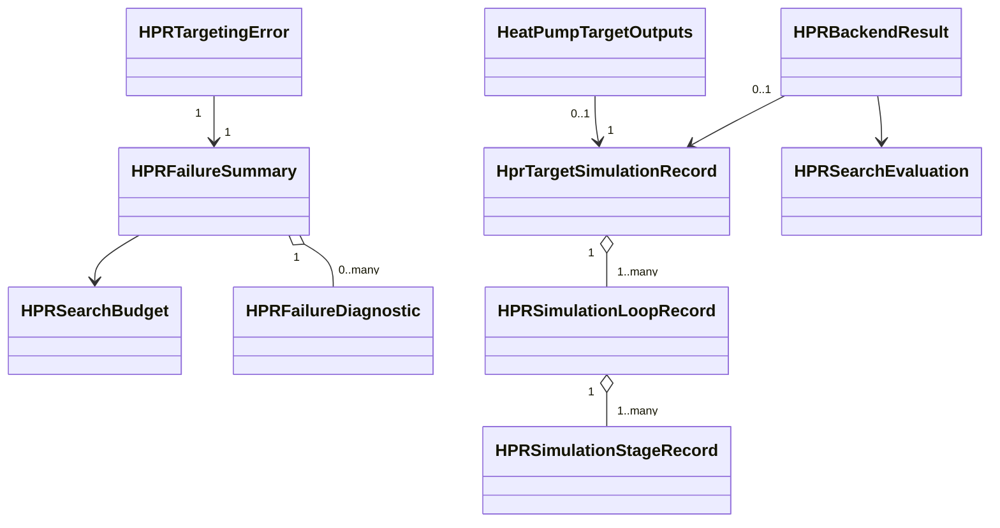

# Unit 1 Domain Entities

## Domain Model Overview

**Text alternative**: A failure summary contains bounded representative
diagnostics and one budget; a targeting error exposes one summary. Internal
backend results produce search evaluations or a finalized public output.
Successful simulated results reference one generalized simulation record, which
contains ordered loop records and ordered stage records.

## Value Object: HPRSearchBudget

**Purpose**: represent resolved engine-neutral limits for one HPR solve.

| Field | Type | Constraint |
|---|---|---|
| `maximum_iterations` | integer | exact positive non-boolean; default 300 |
| `maximum_evaluations` | integer | exact positive non-boolean; default 1,000,000 |

**Characteristics**:

- immutable and detached;
- equality is value equality;
- contains no restart count because the existing `max_multi_start` remains a
  separate request concern;
- contains no wall-clock duration because time cancellation is outside scope;
- maps to optimizer-specific names only in Unit 2.

## Enum: HPREvaluationMode

| Value | Meaning |
|---|---|
| `search` | compute rankable scalar/core facts; prohibit public artifacts |
| `final` | recompute the selected point and build complete accepted artifacts |

The mode is an internal analysis concept. It is not added to the public target.

## Value Object: HPRSearchEvaluation

**Purpose**: represent the detached outcome of one search-mode candidate.

| Field | Type | Constraint |
|---|---|---|
| `point` | immutable tuple of floats | finite and dimensionally valid |
| `objective` | float or absent | finite when success is true |
| `success` | boolean | exact |
| `failure` | diagnostic or absent | present exactly when a classified local failure exists |
| `core_facts` | bounded detached mapping | no streams, engine model, figure, or exception |

**Invariant**: exactly one of finite-success or classified-failure is present.
Malformed/fatal outcomes are exceptions and never instances of this entity.

## Enum: HPRFailureCategory

The closed foundational category set is:

| Value | Intended owner |
|---|---|
| `preflight_rejection` | Unit 2 |
| `candidate_physical_infeasibility` | Units 1 and 2 |
| `budget_exhaustion` | Unit 2 |
| `no_viable_candidate` | Unit 2 |
| `direct_mvr_required_state` | Unit 3 |
| `fatal_internal_boundary` | classification/audit only; original exception propagates |

A fatal category may support internal classification evidence, but a fatal
exception is not converted into an `HPRTargetingError` candidate summary.

## Value Object: HPRFailureDiagnostic

**Purpose**: carry one stable, detached, bounded failure fact.

| Field | Type | Constraint |
|---|---|---|
| `category` | `HPRFailureCategory` | required |
| `reason_code` | closed non-empty string/enum | stable OpenPinch-owned value |
| `summary` | string | sanitized, single-line, bounded |
| `fluid` | string or absent | trimmed and bounded |
| `stage_index` | integer or absent | owning service declares zero/one-based convention |
| `period_id` | string or absent | non-empty when present |
| `candidate_index` | integer or absent | non-negative |
| `topology` | topology identifier or absent | closed value |

**Prohibited fields**: exception object, traceback, live model, engine-specific
state object, callable, or unbounded raw engine output.

## Value Object: HPRFailureSummary

**Purpose**: freeze bounded diagnostic evidence when a public targeting request
cannot return a result.

| Field | Type | Constraint |
|---|---|---|
| `simulation_backend` | closed backend identifier | required |
| `cycle` | closed/validated cycle identifier | required |
| `evaluated_count` | integer | non-negative |
| `category_counts` | immutable category-to-count mapping | non-negative counts |
| `representative_failures` | immutable diagnostic tuple | fixed positive cap |
| `budget` | `HPRSearchBudget` | required |
| `warm_start_evaluated` | boolean | required |
| `warm_start_viable` | boolean | cannot be true when evaluated is false |

The exact representative cap is selected in Unit 2 NFR Design, but the contract
requires it to be finite, positive, and enforced.

## Exception: HPRTargetingError

**Base class**: `ValueError`.

**Payload**: exactly one immutable `HPRFailureSummary`.

**Message**: concise bounded summary suitable for ordinary callers. It names
backend, cycle, evaluated count, and dominant category without copying raw
CoolProp/TESPy output.

**Ownership**: Unit 1 defines the exception contract; Unit 2 decides when to
raise it.

## Enum: HPRTopologyIdentifier

The generalized record uses a closed topology identity independent of the
display name:

- `single_stage_vapour_compression`;
- `cascade_vapour_compression`;
- `parallel_vapour_compression`;
- `vapour_compression_mvr`.

Analytical Carnot and Brayton targets do not require a simulated-engine record.
TESPy currently supports only its approved single-stage shape, while CoolProp
may populate all listed shapes.

## Value Object: HPRSimulationStageRecord

**Purpose**: describe one accepted nominal thermodynamic stage without engine
state.

| Field | Type | Constraint |
|---|---|---|
| `stage_id` | string | unique within loop; non-empty |
| `ordinal` | integer | contiguous, zero-based ordering |
| `role` | closed role | compressor/VC/MVR/evaporator/condenser evidence role |
| `fluid_spec` | string | canonical non-empty specification |
| `evaporating_or_suction_temperature` | float or absent | finite when applicable |
| `condensing_or_discharge_temperature` | float or absent | finite when applicable |
| `source_approach_temperature` | float or absent | finite and non-negative |
| `sink_approach_temperature` | float or absent | finite and non-negative |
| `compressor_isentropic_efficiency` | float or absent | in (0, 1] |
| `motor_efficiency` | float or absent | in (0, 1] |
| `useful_duty` | float or absent | finite and positive when present |
| `compressor_work` | float or absent | finite and non-negative when present |
| `assumptions` | bounded JSON-value mapping | detached and non-empty when required |

Fields irrelevant to a role remain absent; they are not filled with sentinel
numbers.

## Value Object: HPRSimulationLoopRecord

**Purpose**: group ordered stages that share a physical refrigerant or MVR loop.

| Field | Type | Constraint |
|---|---|---|
| `loop_id` | string | unique within target record |
| `ordinal` | integer | contiguous, zero-based ordering |
| `loop_role` | `vapour_compression` or `mvr` | required |
| `fluid_spec` | string | canonical non-empty specification |
| `stages` | immutable stage tuple | non-empty, ordered, unique |
| `nominal_duty` | float | finite and positive |
| `nominal_work` | float | finite and non-negative |

## Extended Entity: HprTargetSimulationRecord

**Existing compatible fields retained**:

- backend, mode, model ID, refrigerant specification;
- nominal evaporating/condensing temperature and useful duty;
- approach temperatures, compressor efficiency, superheat, subcooling, IHX
  gas-temperature change;
- evaporator/condenser count, period ID, engine version;
- compressor-only power boundary and assumptions.

**Additive fields**:

| Field | Type | Constraint |
|---|---|---|
| `topology_id` | `HPRTopologyIdentifier` | required for new records; old single-stage data migrates deterministically |
| `loops` | immutable loop tuple | ordered; topology-consistent |
| `schema_version` | stable version string | additive evolution and migration evidence |

**Compatibility interpretation**:

- the existing `cycle_id` field remains accepted for current single-stage
  records;
- when reading old records, `cycle_id=single_stage_vapour_compression`
  deterministically implies the matching topology and one loop/stage;
- new multi-loop records populate `topology_id` and `loops`;
- existing top-level nominal fields describe the overall accepted design basis,
  not an arbitrary stage.

## Existing Internal Entity: HPRBackendResult

Unit 1 retains `HPRBackendResult` as the internal analysis result.

**Search mode**:

- scalar/core facts populated;
- artifacts absent or contain no model/figure;
- simulation record absent;
- never translated directly to public output.

**Final mode**:

- complete public facts populated;
- internal `HPRThermoArtifacts.model` may exist only until finalization;
- canonical simulation record required for a successful simulated topology;
- translation removes model/figure.

The entity may gain explicit evaluation-mode or helper behavior, but public
consumers do not receive it.

## Existing Public Entity: HeatPumpTargetOutputs

**Compatibility**:

- field names remain stable;
- `model` remains present and optional;
- every finalized instance has `model=None`;
- `target_simulation_record` is canonical engine/design evidence;
- nested period outputs are recursively detached.

## Entity Relationship and Ownership Rules

1. Contracts import no analysis, application, optimizer, or CoolProp type.
2. A simulation record owns loops; a loop owns stages.
3. Failure summaries own immutable copies of diagnostics and budgets.
4. Targeting errors expose summaries but do not expose mutable accumulators.
5. Search evaluations may reference diagnostics, never exceptions.
6. Public outputs reference detached simulation records, never internal
   artifacts.
7. Multiperiod parents own detached period outputs and may share immutable
   contract values by value only.

## Validation Lifecycle

1. Validate primitive field types and bounds.
2. Validate local entity invariants.
3. Validate loop/stage ordering and uniqueness.
4. Validate topology-to-loop relationships.
5. Validate result-to-record numerical consistency.
6. Recursively validate public object-graph detachment.
7. Perform transaction deep copy before commit.

Failure at steps 1 through 6 is fatal during finalization. Failure at step 7 is
fatal and atomic at the transaction boundary.

## Testable Properties

| Entity | Category | Property |
|---|---|---|
| `HPRSearchBudget` | Round-trip/invariant | Valid models round-trip and contain exact positive integers |
| `HPRFailureDiagnostic` | Round-trip/invariant | Sanitized bounded fields survive round-trip without forbidden objects |
| `HPRFailureSummary` | Invariant | Counts are non-negative, warm-start flags coherent, representatives capped |
| `HPRTargetingError` | Easy verification | It is catchable as `ValueError` and exposes the exact immutable summary |
| `HPRSearchEvaluation` | Invariant | Exactly one of finite success or classified local failure is represented |
| Stage/loop records | Induction | Adding the next valid ordinal preserves order and uniqueness |
| Simulation record | Round-trip/invariant | Valid topology evidence round-trips and remains topology-consistent |
| Backend-to-output translation | Invariant | Internal model/figure fields never appear in public output |
| Multiperiod output | Induction | Adding one detached period preserves recursive detachment |
| Public output | Easy verification | Deep copy succeeds and contains no forbidden type |

## PBT-01 Compliance

**Compliant**. Each new or extended entity has explicit round-trip, invariant,
induction, or easy-verification properties. Reusable domain generators must
respect field constraints and produce both single-stage and multi-loop
topologies. PBT-06 is N/A to immutable entity models; Unit 2 owns the mutable
search accumulator/state model.
