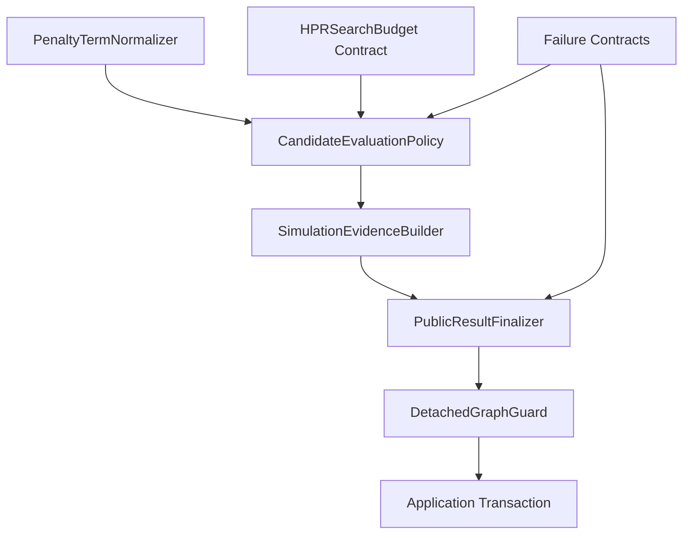

# Unit 1 Logical Components

## Component Map

**Text alternative**: The penalty normalizer, budget contract, and failure
contracts support the candidate evaluation policy. Accepted final evaluation
uses the simulation evidence builder and public result finalizer. The detached
graph guard validates the output before the existing application transaction.

## PenaltyTermNormalizer

**Owner**: small shared HPR analysis helper.

**Input**: scalar or rectangular numeric array-like penalty value.

**Output**: immutable tuple of finite floats.

**NFR behavior**: pure, O(n), deterministic, idempotent, no engine import.

## CandidateEvaluationPolicy

**Owner**: existing HPR objective/adapter seam.

**Input**: objective callable, point, typed arguments, explicit evaluation mode.

**Output**: search fact or final internal backend result.

**NFR behavior**: shared numerical core, zero public artifact builds in search
mode, fatal/local split, no retries.

## HPRSearchBudget Contract

**Owner**: `OpenPinch/contracts/hpr.py`.

**Input**: exact validated positive integer fields.

**Output**: immutable budget with defaults 300 and 1,000,000.

**NFR behavior**: detached, round-trip safe, engine-neutral.

## Failure Contracts

**Owner**: HPR contracts plus a small analysis classification helper.

**Types**: category enum, diagnostic, summary, and
`HPRTargetingError(ValueError)`.

**NFR behavior**: closed codes, bounded sanitized text, capped representatives,
no exception object.

## SimulationEvidenceBuilder

**Owner**: existing HPR target-record boundary.

**Input**: accepted final numerical facts and transient engine facts.

**Output**: generalized detached record with ordered loops/stages.

**NFR behavior**: backward-compatible projection, topology consistency, finite
bounded data, no engine state retention.

## PublicResultFinalizer

**Owner**: HPR backend-to-public translation seam.

**Input**: successful final `HPRBackendResult`.

**Output**: validated `HeatPumpTargetOutputs` with `model=None`.

**NFR behavior**: recursive period finalization, model/figure omission,
canonical record requirement.

## DetachedGraphGuard

**Owner**: small analysis-contract boundary helper.

**Input**: proposed public output graph.

**Output**: same output on success; typed fatal error on forbidden/unknown type.

**NFR behavior**: O(v + e), identity tracking, allowlisted detached types,
fail-closed arbitrary types.

## Application Transaction

**Owner**: existing application execution/recording path.

**Input**: finalized public target/result.

**Output**: deep-copied committed state.

**NFR behavior**: atomic mutation after successful copy; no Unit 1 replacement
or new transaction layer.

## Dependency Constraints

1. Contracts are leaf data models and import no analysis or engine package.
2. The normalizer imports only stable numeric utilities.
3. The evaluator may depend on contracts and topology functions, not application.
4. The evidence builder may inspect transient engine facts but returns only
   contracts.
5. The graph guard stays inside analysis and does not force contracts to import
   CoolProp/TESPy.
6. The transaction depends on finalized outputs; finalization never calls back
   into application.
7. No logical component is independently deployed or persisted.

## NFR Traceability

| Component | Primary NFR IDs |
|---|---|
| PenaltyTermNormalizer | 001, 005, 007, 021 |
| CandidateEvaluationPolicy | 003, 004, 007, 008, 012 |
| HPRSearchBudget Contract | 015, 017 |
| Failure Contracts | 013, 018, 019 |
| SimulationEvidenceBuilder | 016, 017 |
| PublicResultFinalizer | 009, 011, 017, 020 |
| DetachedGraphGuard | 002, 009, 013, 014 |
| Application Transaction | 010 |
| Test matrix across components | 006, 022, 023, 024, 025 |

Every NFR-U1-001 through NFR-U1-025 is assigned.

## Verification Hooks

- dependency-free pure functions accept injected fake data;
- artifact factory hooks expose deterministic search/final call counts;
- the graph guard accepts a forbidden-type registry for isolated tests without
  importing optional engines in base contract profiles;
- record builders accept detached solved facts;
- transaction tests snapshot state before deliberate copy failure;
- centralized Hypothesis strategies generate valid/invalid component inputs.

## PBT Compliance

Logical boundaries expose all Unit 1 properties without requiring integration
with a real optimizer. The real CoolProp deep-copy regression complements, but
does not replace, generated detached-graph properties.
