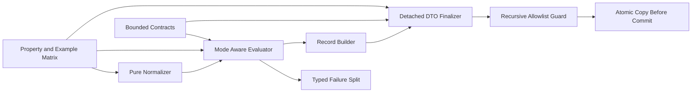

# Unit 1 NFR Design Patterns

## Pattern 1 — Pure Normalization Boundary

`PenaltyTermNormalizer` is a pure function from documented scalar/rectangular
input to an immutable finite tuple. It has no logging, engine calls, global
state, or topology-specific branches.

**Satisfies**: NFR-U1-001, 005, 007, 021.

## Pattern 2 — Explicit Evaluation Mode

Every candidate evaluation declares `search` or `final`. Search mode omits
public artifacts; final mode constructs them once. The shared numerical core and
objective formula are common.

**Satisfies**: NFR-U1-003, 004, 007, 008.

## Pattern 3 — Typed Failure Split

A closed classification separates candidate-local physical facts from fatal
exceptions. Fatal failures retain causal chaining and bypass candidate ranking.
No retry pattern is applied.

**Satisfies**: NFR-U1-008, 012, 018, 019.

## Pattern 4 — Detached Public DTO

Public outputs and nested simulation evidence are frozen/validated detached
records. Internal engine artifacts terminate at the finalization boundary.

**Satisfies**: NFR-U1-009, 011, 016, 017, 020.

## Pattern 5 — Recursive Allowlist Guard

An identity-tracked visitor traverses the public graph once. Known detached
Pydantic/domain/NumPy/container types are inspected; engine, callable, resource,
exception, artifact, and unknown arbitrary types fail closed.

**Satisfies**: NFR-U1-002, 009, 013, 014.

## Pattern 6 — Atomic Copy Before Commit

The existing application transaction deep-copies finalized output before
mutating state. Validation/copy failure preserves the previous committed state.

**Satisfies**: NFR-U1-009, 010.

## Pattern 7 — Backward-Compatible Record Evolution

The current record gains schema version, topology, loops, and stages. A
deterministic single-stage compatibility projection preserves old field meaning.
No parallel public record hierarchy is introduced.

**Satisfies**: NFR-U1-016, 017.

## Pattern 8 — Explicit Bounded Values

Budgets use exact positive integers. Diagnostics use closed codes, bounded
strings, and capped representatives. Bounds are checked at construction, not
after accumulation.

**Satisfies**: NFR-U1-013, 015, 016, 018, 019.

## Pattern 9 — Linear Call-Local Lifetime

Normalization, graph validation, and record validation allocate state within
one call and release it on return/raise. Identity sets and intermediate tuples
scale linearly and are never retained globally.

**Satisfies**: NFR-U1-001, 002, 005, 006.

## Pattern 10 — Property plus Example Test Matrix

Reusable Hypothesis strategies verify general invariants, round trips,
idempotence, and oracle equivalence. Explicit examples pin the reproduced
penalty-shape and live-model transaction failures.

**Satisfies**: NFR-U1-022, 023, 024 and PBT-02 through PBT-05, PBT-07,
PBT-08, PBT-10.

## Pattern Interaction

**Text alternative**: Bounded contracts feed evaluation and finalization. The
pure normalizer feeds the mode-aware evaluator, which uses the typed failure
split and accepted-record builder. The detached finalizer passes through a
recursive allowlist guard before atomic copy/commit. Property and example tests
cover normalization, evaluation, and finalization.

## Resilience, Scalability, and Security Disposition

- Retries, circuit breakers, queues, replicas, failover, and disaster recovery
  are N/A for deterministic in-process transformations.
- Scale is bounded by candidate penalty terms and the detached object graph;
  linear algorithms and no retained global state are sufficient.
- Authentication and authorization are N/A. Defensive security is delivered by
  input validation, bounded outputs, sanitization, and fail-closed object types.
- Monitoring infrastructure is N/A; typed exceptions and deterministic test
  evidence are the observability boundary.

## PBT Compliance

Patterns preserve the Unit 1 property inventory. PBT-06 remains N/A because
these patterns deliberately avoid mutable service state. No blocking finding
exists.
