# Unit 1 Logical Components

## Production Component Map

Logical components may share a source module when cohesion remains high, but
their responsibilities and dependency direction are fixed.

| Logical component | Proposed owner | Input | Output | Complexity |
|---|---|---|---|---|
| Specialist contract family | `OpenPinch.contracts.utility_placement` | Public schema values | Frozen requests/templates/results | Linear in nested contract size |
| Error taxonomy | `OpenPinch.analysis.utility_placement.errors` | Stable code/context | Typed exception or diagnostic | Constant per failure |
| Canonical unit adapter | `OpenPinch.analysis.utility_placement.normalization` | Value/source/canonical unit | Finite canonical float | Constant per value |
| Request normalizer | `OpenPinch.analysis.utility_placement.normalization` | Public request/kwargs | Frozen request specification | `O(L)` |
| Template blueprint builder | `OpenPinch.analysis.utility_placement.normalization` | Counts/optional templates | Complete `TemplateBlueprintSet` | `O(L)` |
| Envelope validator/reducer | `OpenPinch.analysis.utility_placement.bounds` | Blueprints and period bounds | Physical coordinate intersections | `O(P*D)` |
| Order-bound propagator | `OpenPinch.analysis.utility_placement.bounds` | Effective supply intervals | Tightened feasible chains | `O(L)` |
| Initial-point builder | `OpenPinch.analysis.utility_placement.bounds` | Tightened bounds/schema | Verified deterministic starts | `O(D)` |
| Decision-schema builder | `OpenPinch.analysis.utility_placement.codec` | Effective templates | Stable coordinate tuple/index | `O(D)` |
| Placement codec | `OpenPinch.analysis.utility_placement.codec` | Schema plus placement/point | Point or decoded placement | `O(D)` |
| Candidate verifier | `OpenPinch.analysis.utility_placement.codec` | Model plus decoded placement | `CandidateVerification` | `O(L + D)` |
| Pure model facade | `OpenPinch.analysis.utility_placement` specialist facade | Request/blueprints/envelope | `UtilityPlacementModel` and codec operations | Sum of delegated linear stages |
| Result contract validator | Specialist contract family | Nested result data | Frozen JSON-safe result | Linear in result size |

## Specialist Facade

The facade is the only interface later analysis/application components need for
Unit 1 behavior:

```python
normalize_utility_placement_request(...) -> UtilityPlacementRequest
prepare_template_blueprints(request) -> TemplateBlueprintSet
build_utility_placement_model(
    request,
    blueprints,
    envelope,
    *,
    convert_value=convert_placement_value,
) -> UtilityPlacementModel
encode_placement(model, placement) -> tuple[float, ...]
decode_placement(model, point) -> DecodedPlacement
verify_placement(model, placement) -> CandidateVerification
```

The exact module exports are finalized during Code Generation planning. They
remain specialist imports and do not change `OpenPinch.__all__`.

## Validated Data Flow

The Mermaid graph was validated before insertion: it contains 13 declared
nodes and 15 edges, every edge references a declared identifier, labels are
quoted, and fences are balanced.

```mermaid
flowchart LR
    Caller["Unit 3 caller or Unit 2 service"]
    Contracts["Specialist frozen contracts"]
    Normalizer["Request and template normalizer"]
    Units["Canonical unit adapter"]
    Blueprints["Template blueprint set"]
    Context["Unit 2 context builder"]
    Envelope["Detached feasibility envelope"]
    Facade["Unit 1 pure model facade"]
    Bounds["Envelope reduction and order propagation"]
    Codec["Decision schema and codec"]
    Verifier["Independent candidate verifier"]
    Model["Frozen placement model"]
    Errors["Typed errors and diagnostics"]

    Caller --> Contracts
    Contracts --> Normalizer
    Normalizer --> Units
    Normalizer --> Blueprints
    Blueprints --> Context
    Context --> Envelope
    Envelope --> Facade
    Blueprints --> Facade
    Facade --> Bounds
    Bounds --> Codec
    Codec --> Verifier
    Verifier --> Model
    Normalizer --> Errors
    Bounds --> Errors
    Verifier --> Errors
```



Text alternative: a Unit 2/3 caller supplies frozen specialist values to the
normalizer, which uses the canonical unit adapter and produces template
blueprints. Unit 2 consumes those blueprints to build a detached feasibility
envelope, then calls the Unit 1 facade with both. The facade reduces/tightens
bounds, builds the decision schema/codec, verifies starts/candidates, and
returns a frozen placement model. Normalization, bounds, and verification use
the shared typed error/diagnostic vocabulary. The arrows show runtime data flow;
package dependency still points from Unit 2 to Unit 1, never the reverse.

## Component Contracts

### Specialist contract family

- Owns field names, enum values, validation-local invariants, JSON schema, and
  result shape.
- Does not perform process-aware envelope construction or call analysis
  services.
- Uses frozen nested values and ordered tuples.
- Rejects extra fields and non-finite serializable floats.

### Error taxonomy

- Creates stable codes and serializable context.
- Invalid-input subclasses preserve `ValueError` compatibility.
- Does not log, format reports, or store exception instances in results.
- Later units extend the root for targeting/objective/optimiser failures.

### Canonical unit adapter

- Is the only Unit 1 component that calls `Value.to`.
- Accepts explicit quantity/canonical-unit metadata.
- Returns a plain finite float or raises `UtilityPlacementUnitError` with field
  and unit context.
- Can be substituted in focused tests by callable injection; it never replaces
  or mutates the application Pint registry.

### Request normalizer and blueprint builder

- Validate call-shape/count/objective/template structure in deterministic rule
  order.
- Convert each supplied value at most once.
- Produce either a complete generated blueprint inventory or complete caller
  inventory; partial implicit filling is prohibited.
- Retain caller side order/placement rank while also deriving stable family
  views used by the coordinate schema.

### Envelope validator and bound components

- Require exact template/period/coordinate agreement.
- Use ephemeral key-position dictionaries for validation only.
- Reduce each period-coordinate interval once and retain active-limit
  provenance.
- Apply caller narrowing and positive-Kelvin checks.
- Propagate independent chains and generated same-kind identity constraints;
  verify generated cross-kind adjacency on a transient supply-temperature sort.
- Create and independently verify at least one deterministic start.

### Decision schema, codec, and verifier

- Build `N_iso + 2*N_sens` generated-pair coordinates, or the independent
  `2*N_iso + 4*N_sens` tuple, once.
- Preserve fixed coordinates with equal bounds.
- Encode/decode in one pass and derive hot/cold target direction.
- Verify key coverage, finiteness, bounds, spans, Kelvin positivity, ordering,
  and separation without calling normalization or bounds construction again.
- Return ordered diagnostics for ordinary candidate failure.

### Pure model facade

- Coordinates already pure components; it contains no duplicated validation or
  numerical rule.
- Accepts Unit 2's detached envelope as a Unit 1 contract, not a Unit 2 object.
- Returns complete immutable models only.
- Emits no log, warning, stdout/stderr text, cache entry, or application state.

## Failure Routing

| Failure source | Component response | Retry/recovery |
|---|---|---|
| Invalid objective/count/options | Request validation error | None |
| Template inventory/kind/identity/economics | Template validation error | None |
| Unit incompatibility/conversion | Unit error from adapter | None |
| Envelope key/period mismatch | Model validation error | None |
| Empty interval/order chain/Kelvin region | Empty feasible-region error | None |
| Wrong/non-finite/out-of-bound candidate | Structured candidate diagnostic | Unit 2 may evaluate another candidate |
| Internal verified-start invariant | Model validation error with evidence | None |
| Non-serializable/private result value | Contract validation error | None |

No component catches the specialist root merely to continue. Application or
batch boundaries in Unit 3 own error isolation between independent cases.

## Performance Allocation

The only normative performance gate is the approved combined p95 <= 250 ms.
For diagnosis, the benchmark records these non-normative allocation targets:

| Pipeline segment | Diagnostic share |
|---|---:|
| Request units/templates/blueprints | 50 ms |
| Envelope validation, reduction, and ordering | 150 ms |
| Schema, primary start, decode, and verification | 50 ms |

An individual share may move while the total and linear scaling requirements
remain satisfied. Any optimization must preserve frozen values, deterministic
order, typed diagnostics, and property tests.

## Test and Verification Components

| Test component | Responsibility |
|---|---|
| Reusable strategies | Generate valid/invalid requests, templates, envelopes, models, points, and result contracts |
| Example suites | Pin 43 business rules and critical boundary outcomes |
| Property suites | Implement all PBT-01 properties with seed/shrinking |
| Unit conversion oracle suite | Compare adapter output with canonical `Value.to` behavior |
| Performance suite | p95 representative fixture and one-dimension scaling comparisons |
| Architecture suite | Enforce layer imports and root facade |
| Contract snapshot suite | Protect schema/enum/JSON compatibility |
| Packaging smoke | Import specialist owners from built wheel/source distribution |

## Infrastructure Components

| Component type | Status | Rationale |
|---|---|---|
| Queue/worker | N/A | All operations are local synchronous pure calls |
| Cache | N/A | No retained state; deterministic reconstruction is sufficient |
| Circuit breaker/retry controller | N/A | No remote or transient dependency |
| Database/object storage | N/A | No persistence requirement |
| Network/API gateway | N/A | No remote service boundary |
| Auth/secret manager | N/A | Security extension disabled and no credential boundary |
| Monitoring/alerting service | N/A | Unit emits structured context; application boundary owns observability |

## NFR Traceability

| NFRs | Logical components/patterns |
|---|---|
| U1-NFR-001 through U1-NFR-003 | Blueprint, envelope/bounds, schema/codec, NFRP-05 through NFRP-08 and NFRP-15 |
| U1-NFR-004 through U1-NFR-006 | Unit adapter, tolerance policy, normalizer, NFRP-03, NFRP-09, NFRP-10 |
| U1-NFR-007 through U1-NFR-009 | Facade/errors/frozen models, NFRP-01, NFRP-02, NFRP-11 |
| U1-NFR-010 | Contracts/unit adapter/serialization, NFRP-01, NFRP-09, NFRP-12 |
| U1-NFR-011 and U1-NFR-012 | Errors/contracts/facade, NFRP-11 through NFRP-13 |
| U1-NFR-013 through U1-NFR-016 | All owner boundaries and compatibility gates, NFRP-04, NFRP-13 |
| U1-NFR-017 and U1-NFR-018 | Test/benchmark components, NFRP-14 and NFRP-15 |

All 18 approved Unit 1 NFRs have at least one production or verification owner.
Security and Resiliency extensions remain disabled; their infrastructure
patterns are not introduced.

Validation set: U1-NFR-001, U1-NFR-002, U1-NFR-003, U1-NFR-004, U1-NFR-005,
U1-NFR-006, U1-NFR-007, U1-NFR-008, U1-NFR-009, U1-NFR-010, U1-NFR-011,
U1-NFR-012, U1-NFR-013, U1-NFR-014, U1-NFR-015, U1-NFR-016, U1-NFR-017,
and U1-NFR-018.
