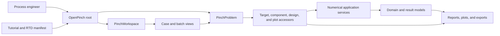
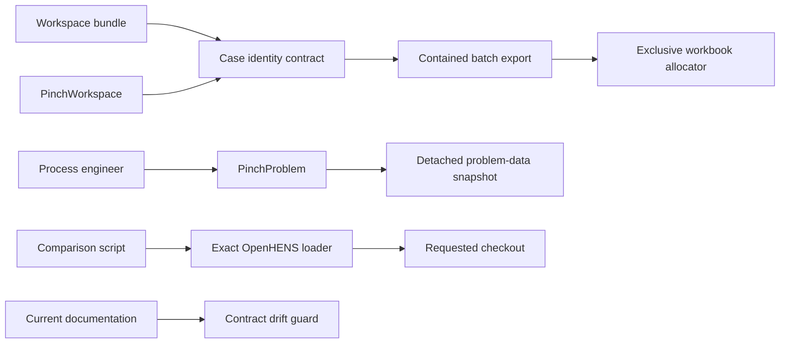

# Component Dependencies

| Component | Depends on | Consumed by |
|---|---|---|
| Segmented stream domain | `Stream`, `Value`, units | Collections, zones, all thermal services |
| Input normalizer | Schemas, segmented domain | Problem/workspace loading |
| Segment numeric projection | Collections, segmented domain | Problem tables, area targeting |
| Thermal adapters | Segment projection, profile builder | Direct/indirect/HPR/MVR |
| HEN profile model | Prepared arrays, solver abstraction | PDM, TDM, EVM |
| Reporting | Domain and solved HEN data | Public outputs, diagrams, verification |

Data flows from structured input or calculated thermodynamic profiles into one parent stream, expands into segment rows only for thermal calculations, and collapses back to parent-level outputs with nested detail.

## Package Usability Refactor Dependencies

| Component | Depends on | Must not depend on |
|---|---|---|
| Root facade | problem and workspace classes | numerical services, plotting extras |
| Target accessors | argument resolver, problem execution helpers | tutorial or presentation modules |
| Argument resolver | configuration metadata, method specifications | numerical backends |
| Numerical orchestration | prepared domain, internal services | workspace or RTD code |
| Design accessors | fixed prerequisite runner, HEN services, design view | private presentation helpers in user code |
| Observation accessors | cached results, reporting and presentation adapters | target or design dispatch |
| Workspace case/batch views | case repository, problem facade | workflow-string registry |
| Tutorial and RTD contract | root facade, public inventory, manifest | private/concrete application owners |

Text alternative: a process engineer imports the root facade and uses either a
problem or workspace. Problem accessors and workspace case views coordinate
internal numerical services. Services produce domain results consumed by
observational outputs. Tutorials and RTD documentation depend only on the root
facade and verified public inventory.

## Repository Issue Remediation Dependencies

| Component | Depends on | Consumed by | Forbidden dependency |
|---|---|---|---|
| Workspace identity contract | standard library, Pydantic validation | bundle schema, workspace application | reporting or solver services |
| Workspace export boundary | identity contract, `pathlib.Path` | case batch export | raw unvalidated case paths |
| Problem input observation | `deepcopy`, `TargetInput` | problem/workspace callers | prepared-zone mutation |
| Workbook allocator | standard library filesystem APIs | reporting writer | timestamp uniqueness alone |
| Exact OpenHENS loader | `importlib`, `sys`, `pathlib` | comparison runner | ambient cached OpenHENS identity |
| Contract drift guard | canonical root exports, current docs | repository tests | historical audit rewriting |

Text alternative: bundle and runtime workspace inputs share one case-identity
contract before batch export. Batch export uses the exclusive workbook
allocator. Problem observation returns a detached snapshot. The comparison
script reaches OpenHENS only through the exact-checkout loader. Current
documentation is checked by a scoped contract drift guard.
