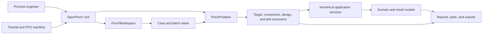
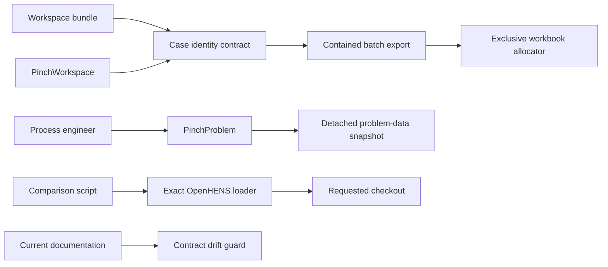
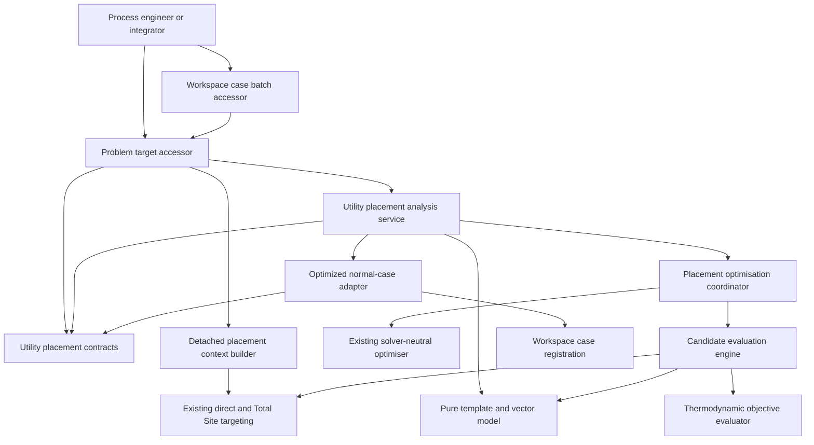
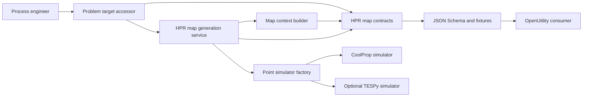

# Component Dependencies

| Component | Depends on | Consumed by |
|---|---|---|
| Segmented stream domain | `Stream`, `Value`, units | Collections, zones, all thermal services |
| Input normalizer | Schemas, segmented domain | Problem/workspace loading |
| Segment numeric projection | Collections, segmented domain | Problem tables, area targeting |
| Thermal adapters | Segment projection, profile builder | Direct/indirect/HPR/MVR |
| HEN profile model | Prepared arrays, solver abstraction | PDM, TDM, EVM |
| Reporting | Domain and solved HEN data | Public outputs, diagrams, verification |

Data flows from structured input or calculated thermodynamic profiles into one parent stream, expands into segment rows only for thermal calculations, and collapses back to parent-level outputs with nested detail.

## Package Usability Refactor Dependencies

| Component | Depends on | Must not depend on |
|---|---|---|
| Root facade | problem and workspace classes | numerical services, plotting extras |
| Target accessors | argument resolver, problem execution helpers | tutorial or presentation modules |
| Argument resolver | configuration metadata, method specifications | numerical backends |
| Numerical orchestration | prepared domain, internal services | workspace or RTD code |
| Design accessors | fixed prerequisite runner, HEN services, design view | private presentation helpers in user code |
| Observation accessors | cached results, reporting and presentation adapters | target or design dispatch |
| Workspace case/batch views | case repository, problem facade | workflow-string registry |
| Tutorial and RTD contract | root facade, public inventory, manifest | private/concrete application owners |

```mermaid
flowchart LR
    User["Process engineer"] --> Root["OpenPinch root"]
    Root --> Problem["PinchProblem"]
    Root --> Workspace["PinchWorkspace"]
    Problem --> Accessors["Target, component, design, and plot accessors"]
    Workspace --> Cases["Case and batch views"]
    Cases --> Problem
    Accessors --> Services["Numerical application services"]
    Services --> Domain["Domain and result models"]
    Domain --> Output["Reports, plots, and exports"]
    Accessors --> Output
    Docs["Tutorial and RTD manifest"] --> Root
```

Text alternative: a process engineer imports the root facade and uses either a
problem or workspace. Problem accessors and workspace case views coordinate
internal numerical services. Services produce domain results consumed by
observational outputs. Tutorials and RTD documentation depend only on the root
facade and verified public inventory.

## Repository Issue Remediation Dependencies

| Component | Depends on | Consumed by | Forbidden dependency |
|---|---|---|---|
| Workspace identity contract | standard library, Pydantic validation | bundle schema, workspace application | reporting or solver services |
| Workspace export boundary | identity contract, `pathlib.Path` | case batch export | raw unvalidated case paths |
| Problem input observation | `deepcopy`, `TargetInput` | problem/workspace callers | prepared-zone mutation |
| Workbook allocator | standard library filesystem APIs | reporting writer | timestamp uniqueness alone |
| Exact OpenHENS loader | `importlib`, `sys`, `pathlib` | comparison runner | ambient cached OpenHENS identity |
| Contract drift guard | canonical root exports, current docs | repository tests | historical audit rewriting |

```mermaid
flowchart LR
    Bundle["Workspace bundle"] --> Identity["Case identity contract"]
    Workspace["PinchWorkspace"] --> Identity
    Identity --> Export["Contained batch export"]
    Caller["Process engineer"] --> Problem["PinchProblem"]
    Problem --> Snapshot["Detached problem-data snapshot"]
    Export --> Allocator["Exclusive workbook allocator"]
    Script["Comparison script"] --> Loader["Exact OpenHENS loader"]
    Loader --> Checkout["Requested checkout"]
    Docs["Current documentation"] --> Guard["Contract drift guard"]
```

Text alternative: bundle and runtime workspace inputs share one case-identity
contract before batch export. Batch export uses the exclusive workbook
allocator. Problem observation returns a detached snapshot. The comparison
script reaches OpenHENS only through the exact-checkout loader. Current
documentation is checked by a scoped contract drift guard.

## Utility Placement Optimisation Dependencies

### Dependency matrix

| Caller | Allowed dependency | Communication | Prohibited coupling |
|---|---|---|---|
| Problem target accessor | Placement application adapter | Concise inputs to detached optimized case | Numerical equations or optimiser backend calls |
| All-period target accessor | Problem placement workflow | Canonical ordered period selection | Generic independent per-period solve loop |
| Workspace batch accessor | Problem placement workflow, `CaseBatchResult` | Ordered success/error mappings | Active-case mutation or cross-case failure suppression |
| Workspace `add` | Normal `PinchProblem`, canonical load/state owners | Named registered case with placement evidence | Copying unrelated analysis caches |
| Context builder | Domain zone/configuration, existing direct and Total Site services | Isolated zone copy to immutable numerical context | Canonical zone/target mutation |
| Template model | Placement contracts and numerical configuration | Pure normalized templates, bounds, vectors | Application, targeting, or backend imports |
| Placement service | Template model, candidate evaluator, optimisation coordinator | Immutable models and typed evaluations | Application owner or private backend state |
| Candidate evaluator | Detached period context, allocation adapter, entropy evaluator | Decoded placement to period evaluation | Result cache or candidate ranking |
| Thermodynamic evaluator | Numerical helpers and placement value objects | Pure entropy/exergy breakdown | Targeting state or cogeneration |
| Optimisation coordinator | Existing solver-neutral optimisation service | `OptimisationProblem` to ordered finite candidates | Direct backend imports |
| Optimized-case adapter | Source input, best candidate, `PinchProblem` | Normal detached case plus retained evidence | Source mutation |
| Utility-placement notebook | Public target/case/workspace APIs, existing generator and manifest | Generated executable tutorial artifact | CLI invocation, private analysis imports, or manual utility conversion |

### Dependency direction

The validated diagram contains 14 declared nodes and 18 edges; every edge
references a declared identifier, all labels are quoted, and the flowchart
fence contains no nested fences.

```mermaid
flowchart TD
    Caller["Process engineer or integrator"]
    Batch["Workspace case batch accessor"]
    Target["Problem target accessor"]
    Contracts["Utility placement contracts"]
    Context["Detached placement context builder"]
    ExistingTargets["Existing direct and Total Site targeting"]
    Service["Utility placement analysis service"]
    Templates["Pure template and vector model"]
    Coordinator["Placement optimisation coordinator"]
    Optimiser["Existing solver-neutral optimiser"]
    Candidate["Candidate evaluation engine"]
    Entropy["Thermodynamic objective evaluator"]
    CaseAdapter["Optimized normal-case adapter"]
    WorkspaceAdd["Workspace case registration"]

    Caller --> Target
    Caller --> Batch
    Batch --> Target
    Target --> Contracts
    Target --> Context
    Context --> ExistingTargets
    Target --> Service
    Service --> Templates
    Service --> Coordinator
    Coordinator --> Optimiser
    Coordinator --> Candidate
    Candidate --> Templates
    Candidate --> ExistingTargets
    Candidate --> Entropy
    Service --> Contracts
    Service --> CaseAdapter
    CaseAdapter --> Contracts
    CaseAdapter --> WorkspaceAdd
```

Text alternative: callers reach the feature through one problem target
accessor or an ordered workspace batch wrapper. The accessor validates
placement contracts, builds a detached context through existing direct or Total
Site targeting, and delegates to the analysis service. The service uses a pure
template model and an optimisation coordinator. The coordinator calls the
existing solver-neutral optimiser and candidate engine; the candidate engine
uses targeting allocation plus the entropy evaluator. The application adapter
returns a detached normal case, and workspace registration stores that case
without mutating the source or copying unrelated analysis caches. Dependencies
point from application to analysis to domain/contracts and existing reusable
services; none point back into application.

### Communication rules

- All cross-component values are immutable dataclasses or Pydantic contracts;
  mutable `Zone`, stream, target, and backend objects stop at their owner.
- Candidate evaluation is synchronous and deterministic. Any future parallel
  evaluation must preserve input ordering and isolated state and requires a
  separate approved design change.
- Optimiser callbacks expose only a scalar finite penalty or objective to the
  backend; structured evaluations are retained in an analysis-owned lookup for
  final result assembly.
- No new package-root export, runtime dependency, network boundary, file
  boundary, or infrastructure dependency is introduced.
- The notebook is a delivery-time consumer outside the runtime dependency
  graph. Existing generator, manifest, execution-profile, and package-data
  owners verify it after Unit 3 stabilizes the public workflow; no CLI
  dependency is introduced.

## TESPy HPR Performance-Map Dependencies

### Dependency matrix

| Caller | Allowed dependency | Communication | Prohibited coupling |
|---|---|---|---|
| Problem target accessor | HPR contracts and application bridge | Backend selector, successful target, map request | Thermodynamic equations or TESPy imports |
| Application bridge | HPR map context builder and generation service | Validated target plus request | OpenUtility or Pyomo objects |
| HPR targeting service | Point-simulator factory | Normalized backend string and internal context | Silent backend fallback |
| Map context builder | HPR target, map request, plain analysis values | Immutable generation context | Target mutation or runtime engine objects |
| Grid generation service | Point-simulator protocol and map contracts | Ordered operating points to completed map | Candidate economics or MILP constraints |
| CoolProp simulator | Existing HPR cycle calculations | Normalized point simulation | TESPy or application layer |
| TESPy simulator | Optional dependency guard and TESPy | Normalized point simulation | Package import-time TESPy dependency |
| Contract resources | JSON Schema and golden fixtures | Versioned JSON-compatible data | Python-class identity |
| OpenUtility | Vendored schema/fixture data | Plain mapping decode | OpenPinch or TESPy runtime import |

### Dependency direction

The diagram contains ten declared nodes and eleven edges. Node identifiers are
alphanumeric, labels are quoted, and every edge references a declared node.

```mermaid
flowchart LR
    Caller["Process engineer"]
    Target["Problem target accessor"]
    Contracts["HPR map contracts"]
    Service["HPR map generation service"]
    Context["Map context builder"]
    Factory["Point simulator factory"]
    CoolProp["CoolProp simulator"]
    Tespy["Optional TESPy simulator"]
    Resources["JSON Schema and fixtures"]
    OpenUtility["OpenUtility consumer"]

    Caller --> Target
    Target --> Contracts
    Target --> Service
    Service --> Context
    Context --> Contracts
    Service --> Factory
    Factory --> CoolProp
    Factory --> Tespy
    Service --> Contracts
    Contracts --> Resources
    Resources --> OpenUtility
```

Text alternative: a process engineer calls the existing problem target accessor.
The accessor validates map contracts and delegates to the HPR map service. The
service builds an immutable context and obtains either the existing CoolProp
simulator or the optional TESPy simulator through one protocol factory. The
service returns a strict contract, from which OpenPinch publishes JSON Schema and
fixtures. OpenUtility consumes only the data resource; the final diagram edge to
OpenUtility denotes data transfer, not a Python import.

### Communication and import rules

- Public map contracts contain only JSON-compatible values and Pydantic
  validation; they do not import current runtime HPR contracts.
- Application coordinates target identity and request validation, while analysis
  owns simulation and map assembly.
- Concrete simulator modules may import their thermodynamic engine. The protocol,
  context, contracts, and application imports may not import TESPy.
- The optional adapter uses the existing dependency guard at call time. Base
  `import OpenPinch`, contract imports, and CoolProp targeting remain independent
  of TESPy availability.
- OpenUtility is an external conformance consumer. It may copy or vendor schema
  resources for tests but must not appear in OpenPinch runtime dependencies.
- OpenPinch exports no candidate identity, node assignment, period tariff,
  equipment cost, selection variable, dispatch result, or Pyomo formulation.
- Schema changes use explicit version policy and synchronized golden fixtures;
  neither repository infers compatibility from Python dataclass names.
