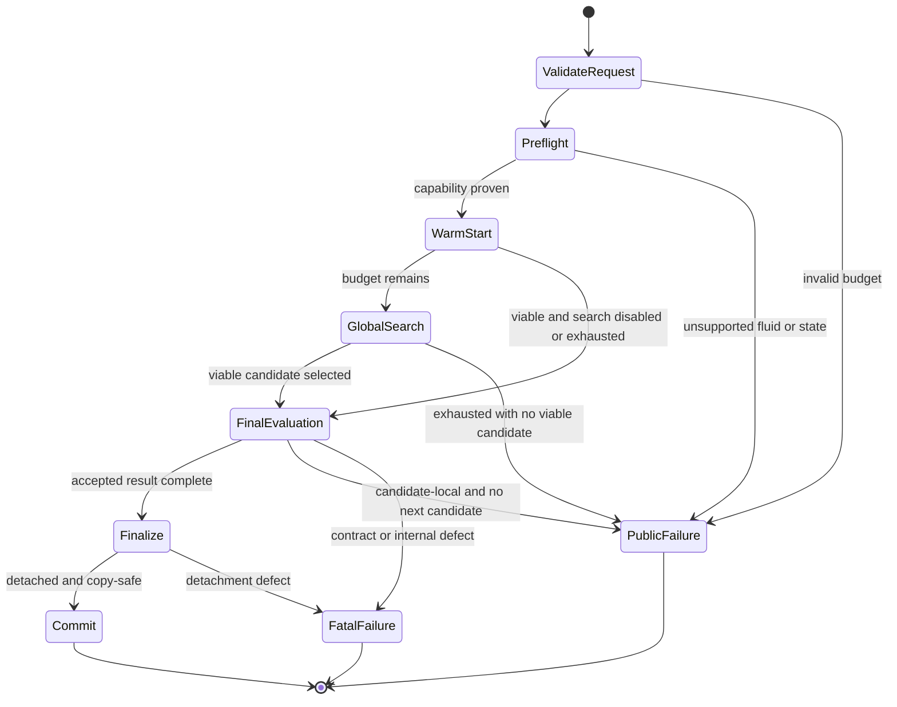

# Application Design: CoolProp-Backed HPR and MVR Reliability

## Status and Authority

This focused design implements the approved investigation requirements without
changing runtime code. User Stories were explicitly skipped, so the approved
requirements document is the acceptance authority.

- Requirements:
  [coolprop-hpr-optimisation-investigation.md](../../requirements/coolprop-hpr-optimisation-investigation.md)
- Components: [components.md](components.md)
- Methods: [component-methods.md](component-methods.md)
- Services: [services.md](services.md)
- Dependencies: [component-dependency.md](component-dependency.md)

## Decision Summary

| Decision | Approved choice | Design consequence |
|---|---|---|
| Public model compatibility | Keep the field; publish `None` | `target_simulation_record` is canonical; no live engine object crosses the boundary |
| No-candidate behavior | Typed `ValueError`-compatible exception | `HPRTargetingError` carries bounded structured diagnostics |
| Budget surface | Explicit optional public controls | Iteration and evaluation limits map to `maxiter` and `maxfun` |
| Warm-start policy | Evaluate with CoolProp first and retain | Global search is optional within budget; a viable baseline survives exhaustion |
| Process-MVR fallback | Typed stage evidence | Named fallbacks are inspectable; unexpected failures raise |
| Organization | Extend existing owners | Small shared preflight/diagnostic helpers; no reliability facade |

## Architecture Outcome

The design preserves the current layered architecture:

1. The public accessor validates and forwards budget intent.
2. The HPR service constructs typed inputs and runs backend-specific preflight.
3. The HPR search coordinator evaluates warm starts first, calls the generic
   optimiser within explicit bounds, and accumulates bounded diagnostics.
4. Topology objectives distinguish lightweight search evaluation from final
   artifact construction.
5. A single finalizer strips live engine state and validates detached output
   before the application transaction copies it.
6. Direct process-MVR remains a separate deterministic component with contextual
   validation and observable named fallbacks.

The reusable optimiser stays independent of HPR and CoolProp. No infrastructure,
dependency, thermodynamic equation, or compressor-power-boundary change is
introduced.

## Core Contracts

### Detached successful result

A simulated successful public target contains:

- complete target streams and accounting;
- `model=None`;
- a detached `target_simulation_record` describing backend, topology, fluids,
  nominal states, efficiencies, power boundary, engine version, and assumptions;
- recursively detached period outputs when applicable.

The existing simulation record is broadened rather than replaced. Existing
single-stage fields remain compatible, while topology/stage facts are represented
with detached primitive structures sufficient for cascade, parallel, and VC+MVR
accepted designs.

### Bounded search request

`HPRSearchBudget` carries positive iteration and evaluation limits from every
public HPR wrapper through single- or multiperiod preparation to
`OptimisationOptions.maxiter` and `maxfun`. Explicit public parameters
override equivalent `options` entries, which override configuration defaults.

### Bounded failure result

`HPRTargetingError(ValueError)` carries an immutable
`HPRFailureSummary`. The summary includes backend, cycle, budget, evaluated
count, category counts, warm-start state, and a fixed maximum number of
sanitized representative failures. It never retains arbitrary exceptions,
tracebacks, or engine objects.

### Process-MVR fallback evidence

Each `DirectGasMVRStageResult` may contain detached diagnostics for only two
approved policies:

- `dry_stage` when an optional injection saturation state is unavailable;
- `reduced_profile` when optional saturation breakpoints are unavailable.

Required state failures are contextual domain errors and remain chained to the
original cause.

## Behavioral State Model

**Text alternative**: The request is validated and preflighted before search. A
viable warm start is retained, then optional global search runs within budget.
A selected point receives final evaluation and detachment before commit.
Unsupported requests or exhausted searches produce typed public failures, while
contract, lifecycle, and detachment defects propagate as fatal failures.

## Failure Classification

| Class | Examples | Coordinator action |
|---|---|---|
| Preflight rejection | Invalid fluid, unsupported dew/bubble state, critical-state conflict | Raise typed public failure before optimiser |
| Candidate-local infeasibility | Documented flash infeasibility or physical constraint violation at one point | Record bounded diagnostic and continue |
| Budget exhaustion | `maxiter` or `maxfun` reached | Return retained viable point, otherwise typed public failure |
| Fatal internal failure | Result type mismatch, malformed penalty shape, lifecycle or detachment bug | Re-raise original failure |
| Direct-MVR named fallback | Optional injection saturation or profile breakpoint unavailable | Continue and attach stage diagnostic |
| Direct-MVR required-state failure | Unsupported target lift/ratio or required flash failure | Raise contextual domain failure with cause |

## Requirement Traceability

### Functional requirements

| Requirement | Design owner | Design response |
|---:|---|---|
| 1 | Candidate objective evaluators | Explicit penalty normalizer rejects unsupported shapes and returns scalar terms |
| 2 | Search coordinator and finalizer | Finite candidates remain viable through ranking, final evaluation, detachment, and commit |
| 3 | Contracts and finalizer | Public `model=None`; canonical detached simulation record |
| 4 | Failure taxonomy | Closed recoverable classification; unexpected failures propagate |
| 5 | Diagnostic accumulator | Counts plus bounded representative structured reasons |
| 6 | CoolProp preflight | VC refrigerants and MVR fluids checked against required state envelopes before search |
| 7 | Accessor, budget contract, search coordinator | Public iteration/evaluation controls and deterministic viable fallback |
| 8 | Objective evaluators | Search mode excludes public artifacts; final mode builds them once |
| 9 | VC+MVR coordinator | CoolProp-evaluated Carnot warm start retained before bounded global search |
| 10 | Direct process-MVR validator | Compression capability validation and contextual property failures |
| 11 | Direct process-MVR results | Only named dry-stage/reduced-profile fallbacks, each with stage evidence |

### Verification requirements

| Requirement | Verification seam |
|---:|---|
| 1 | Real public direct/indirect, heat-pump/refrigeration, cascade/parallel/VC+MVR tests |
| 2 | Optimiser spy proves unsupported fluid/state stops at preflight |
| 3 | Real CoolProp accepted target is copy/deep-copy and serialization safe |
| 4 | Generated scalar/empty/single/multi-term penalty shapes and finite-objective invariants |
| 5 | Model/property test over candidate-local and fatal failure sequences |
| 6 | Notebook 09 asserts default CoolProp target and map success |
| 7 | Deterministic evaluation-count gate plus documented elapsed-time profile |
| 8 | Real direct and utility `mvr_heat_pump` warm-start transaction tests |
| 9 | Invalid MVR-fluid test identifies fluid/stage and proves zero optimiser calls |
| 10 | Packaged direct process-MVR success plus unsupported target and fallback-evidence tests |
| 11 | Notebook 11 separates genuine infeasibility from service defects |

## Detailed-Design Deferrals

Functional Design must decide:

- the closed recoverable exception set and stable reason codes;
- exact penalty-flattening semantics and tolerance behavior;
- exact default limits and their compatibility migration;
- cache-key normalization and floating-point identity policy;
- capability-envelope construction for each topology;
- the precise generalized simulation-record schema;
- direct process-MVR capability thresholds and fallback classifications;
- deterministic test budgets and platform tolerances.

These decisions must not weaken the boundaries approved here.

## Delivery Sequence

1. Correct penalty normalization and detach accepted results.
2. Add the typed failure contracts and bounded accumulator.
3. Add shared CoolProp preflight for VC and MVR state envelopes.
4. Add public budgets, warm-start-first evaluation, and search caching.
5. Harden direct process-MVR validation and fallback evidence.
6. Integrate single- and multiperiod public paths.
7. Add real-engine, property-based, notebook, and time/evaluation regression
   proof.

Units Generation may refine this sequence but may not introduce cyclic
dependencies or combine generic optimiser code with CoolProp-specific behavior.

## Compatibility and Migration

- Existing public method calls remain valid when new controls are omitted.
- Existing target fields retain their names and semantics.
- Consumers reading `model` now receive the already optional value `None`;
  consumers needing reproducible evidence use `target_simulation_record`.
- `HPRTargetingError` remains catchable as `ValueError`.
- TESPy remains explicitly selected and keeps its own preflight; no backend
  fallback is added.
- Direct process-MVR normal-success behavior and result fields remain intact,
  with additive fallback diagnostics.

## Risks and Controls

| Risk | Control |
|---|---|
| Default budget changes feasible outcomes | Real public regression matrix and documented defaults |
| Preflight rejects a state the solver could handle | Topology-derived envelopes plus real-engine boundary tests |
| Search/final modes diverge | Property asserting rankable success survives finalization |
| Diagnostics grow with evaluations | Fixed representative cap with unbounded numeric counts only |
| Cached points alias incorrectly | Functional Design defines exact normalized keys and property tests |
| Compatibility consumers expect live `model` | Field retained, migration documented, simulation record made complete |
| Multiperiod nests live artifacts | Recursive finalization and deep-copy regression |
| Fallback classification becomes too broad | Closed reason codes and unexpected-exception propagation tests |

## Extension Compliance

- **Property-Based Testing — compliant at design level**: observable contracts
  exist for penalty shapes, finite objectives, failure sequences, bounded
  diagnostics, warm-start survival, detachment, cache uniqueness, and service
  state transitions. Exact strategies and seeds are deferred to NFR/Functional
  Design.
- **Security Baseline — N/A**: disabled in
  `aidlc-docs/aidlc-state.md`; skipped.
- **Resiliency Baseline — N/A**: disabled in
  `aidlc-docs/aidlc-state.md`; skipped.

## Approval Boundary

This document defines high-level application structure only. Runtime code,
detailed algorithms, and tests remain unchanged until the subsequent Units
Generation and Construction stages are separately approved.
