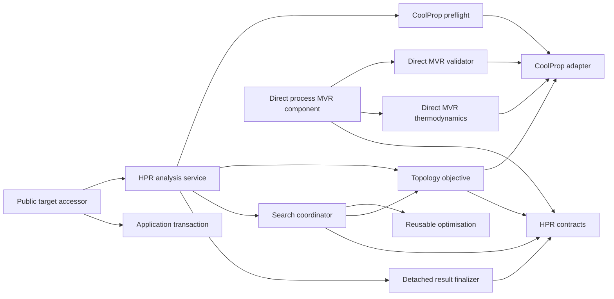
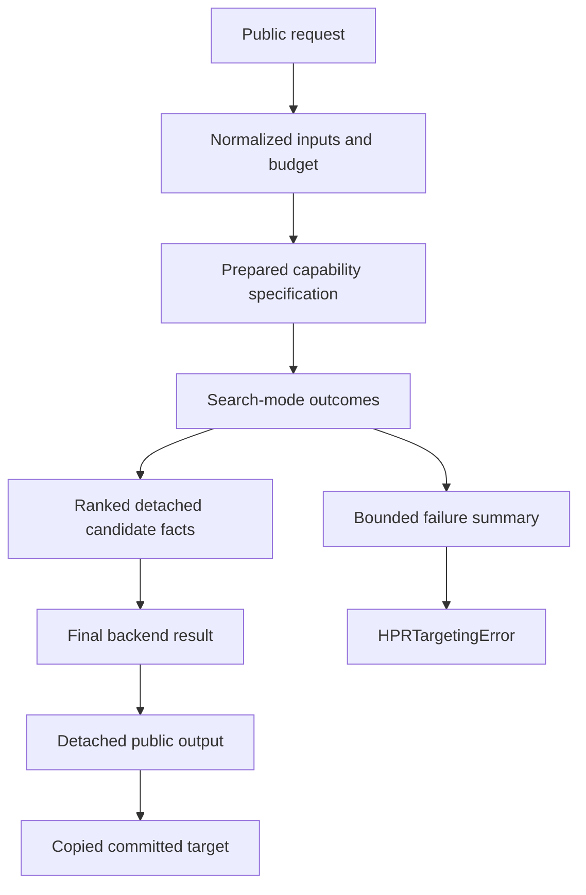

# Component Dependencies: CoolProp HPR and MVR Reliability

## Dependency Direction

**Text alternative**: The public accessor depends on the HPR analysis service
and application transaction. Analysis coordinates preflight, topology
objectives, search, finalization, and contracts. The search coordinator alone
adapts HPR work to the reusable optimiser. CoolProp is a leaf used by preflight,
objectives, and direct-MVR thermodynamics. Direct process-MVR stays independent
of optimised targeting while sharing detached diagnostic contracts.

## Dependency Matrix

| Consumer | Allowed dependency | Purpose | Forbidden dependency |
|---|---|---|---|
| Public target accessor | HPR service, configuration | Parameter forwarding and transaction | CoolProp, topology internals |
| HPR service | contracts, preflight, handler registry, finalizer | Orchestration | Raw optimiser implementation details |
| CoolProp preflight | fluid resolver, CoolProp leaf, contracts | Capability proof | application transaction |
| Topology objective | common HPR helpers, property adapter, domain streams | Candidate physics | public accessor |
| Search coordinator | contracts, topology callable, reusable optimiser | Warm-start and bounded search | direct CoolProp calls |
| Reusable optimiser | generic problem/options/candidate contracts | Numerical search | HPR, fluids, CoolProp |
| Result finalizer | HPR contracts, detached domain records | Public validation | application mutation |
| Multiperiod execution | period preparation, common search/finalizer | Shared-vector targeting | independent budget resets |
| Direct process-MVR | direct-MVR models/thermodynamics, diagnostic contract | Deterministic stage solution | optimised HPR search |
| Tutorials/tests | public APIs | Executable proof | private engine state |

## Contract Flow

**Text alternative**: A public request becomes normalized inputs and a prepared
capability specification. Search produces detached scalar candidate facts. A
chosen candidate becomes a final backend result and then a detached public
output safe for transaction copy. If no candidate is viable, search outcomes
instead freeze into a bounded summary attached to a typed exception.

## Communication Rules

### Public boundary

- Only the accessor accepts public budget arguments.
- Analysis receives typed, already validated budget values.
- The application transaction sees only `HeatPumpTargetOutputs` or the
  containing target model; it never sees an engine object.

### Analysis boundary

- CoolProp preflight returns a detached prepared specification.
- Objectives return `HPRBackendResult`; search mode leaves artifact fields
  absent.
- The coordinator receives candidate-local diagnostics as data.
- Fatal exceptions cross the coordinator unchanged.

### Optimisation boundary

- `OptimisationProblem` receives a scalar callable.
- `OptimisationOptions.maxiter` and `maxfun` receive the public limits.
- The generic optimiser returns candidates or its existing generic exceptions.
- HPR-specific diagnostic translation stays in the HPR coordinator.

### Property-engine boundary

- CoolProp calls remain in adapter, preflight, and direct-MVR thermodynamic
  leaves.
- Raw engine objects and exception strings are never serialized.
- Stable public reason codes are owned by OpenPinch, not by CoolProp.

## Data Ownership and Lifetime

| Data | Owner | Lifetime | Public |
|---|---|---|---:|
| Public budget arguments | accessor | one call | Yes |
| `HPRSearchBudget` | contracts/request | one call | Indirectly |
| Prepared CoolProp specification | analysis | preflight through final evaluation | No |
| Live cycle/property state | engine leaf | one evaluation | No |
| Search cache | search coordinator | one solve | No |
| Failure accumulator | search coordinator | one solve | Via frozen summary on error |
| `HPRBackendResult` | analysis | finalization boundary | No |
| `HprTargetSimulationRecord` | contracts | target lifetime | Yes |
| `HeatPumpTargetOutputs.model` | contracts | target lifetime | Yes, always `None` |
| Process-MVR fallback diagnostic | direct-MVR stage result | component lifetime | Yes |

## Acyclicity Rules

1. `contracts` does not import analysis, application, CoolProp, or optimisation.
2. `optimisation` does not import HPR analysis or contracts.
3. application accessors may call analysis services; analysis never calls the
   accessor.
4. engine leaves do not call service orchestration.
5. direct process-MVR does not call the optimised HPR coordinator.
6. tests and notebooks consume public services and are not runtime dependencies.

## Failure Propagation Matrix

| Origin | Candidate-local | Typed public failure | Propagates unchanged |
|---|---:|---:|---:|
| Unsupported configured fluid/state in preflight | No | Yes | No |
| Documented physical infeasibility at one point | Yes | Only if all points fail | No |
| Search budget exhausted with viable warm start | No | No; return fallback | No |
| Search budget exhausted without viable point | No | Yes | No |
| Malformed objective result or penalty shape | No | No | Yes |
| Detachment/copy contract failure | No | No | Yes |
| Approved direct-MVR optional fallback | No | No; attach diagnostic | No |
| Required direct-MVR property failure | No | Yes, contextual and chained | No |
| Unexpected direct-MVR code failure | No | No | Yes |

## Integration Constraints

- Current service method names and target field meanings remain stable.
- Budget propagation must cover every public cycle wrapper and the shared
  multiperiod input.
- VC+MVR uses both refrigerant and MVR-fluid preflight results.
- The finalizer is common to direct, utility, heat-pump, refrigeration, and
  multiperiod outputs.
- No new package dependency or infrastructure component is permitted.

## Extension Compliance

- **Property-Based Testing**: applicable. Dependency rules support cold-import
  checks, generated failure sequences, bounded accumulator properties, and
  copy/deep-copy invariants.
- **Security Baseline**: disabled; skipped.
- **Resiliency Baseline**: disabled; skipped.
