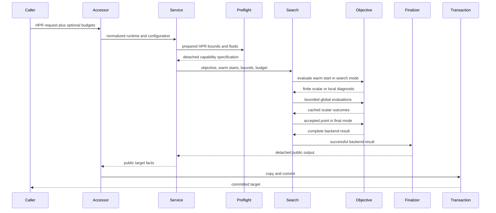
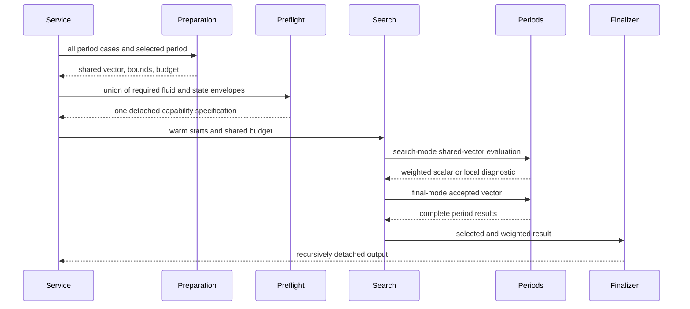
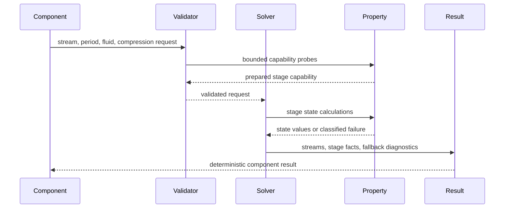

# Service Design: CoolProp HPR and MVR Reliability

## Service Pattern

The public application call remains synchronous and transactional. Reliability is
added inside the analysis boundary: validate once, evaluate lightweight points,
finalize one accepted result, and only then allow the existing application
transaction to copy and commit it.

## Flow 1: Successful Single-Period CoolProp HPR Target

**Text alternative**: The accessor resolves parameters and calls the analysis
service. CoolProp capability is checked before search. The warm start is
evaluated first, followed by only budgeted global evaluations. The accepted
point is evaluated once in final mode, stripped of engine state, copied by the
transaction, and returned.

### Transaction Guarantees

- Preflight and candidate search occur before application state mutation.
- Search failures cannot leave a partially committed target.
- Finalization and copy safety complete before transaction commit.
- A valid retained warm start may be returned after global budget exhaustion.
- The public `model` field is present but `None`.

## Flow 2: No Viable HPR Candidate

1. Preflight succeeds.
2. Warm starts and bounded global candidates are evaluated.
3. Approved thermodynamic failures are counted and sanitized.
4. If no viable point exists, the coordinator freezes a bounded
   `HPRFailureSummary`.
5. It raises `HPRTargetingError`, which is also a `ValueError`.
6. The application transaction commits nothing.

The concise exception message names the backend, cycle, evaluated count, and
dominant failure category. Structured details provide category counts, a small
set of representative reasons, fluids, stages, periods, and budget state.

## Flow 3: CoolProp Preflight Rejection

1. The service derives required state envelopes from prepared bounds.
2. Preflight resolves every VC refrigerant and MVR fluid.
3. An invalid fluid, missing dew/bubble capability, critical-state conflict, or
   unsupported compression state creates a preflight diagnostic.
4. `HPRTargetingError` is raised before
   `run_multistart_minimisation` is called.

A preflight error is not reported as `no local minima` and does not consume the
optimisation budget.

## Flow 4: Fatal Internal Failure

Type mismatches, malformed result contracts, unexpected array shapes, lifecycle
errors, and detachment defects are not candidate-local. The original exception
propagates with its causal chain. The diagnostic accumulator may record counts
already observed, but it must not replace the fatal exception with a penalty or
a generic optimal-result error.

## Flow 5: Multiperiod HPR Target

**Text alternative**: Multiperiod preparation carries one budget and a union of
required states into one preflight. Each shared vector is evaluated across
periods in search mode. Only the accepted vector produces complete per-period
artifacts, and all nested outputs are detached before publication.

### Multiperiod Rules

- One failed period makes that shared vector candidate-local only when the
  failure is an approved physical infeasibility.
- Fatal errors in any period abort the request.
- Evaluation and iteration limits cover the shared search, not each period
  independently.
- The selected-period output and all entries in `period_outputs` obey the same
  no-live-model invariant.

## Flow 6: Direct Process-MVR

**Text alternative**: Before stage solving, a validator checks the stream's
fluid and requested compression range. The solver then performs stage property
calls. Only named saturation and profile fallbacks are recoverable, and each is
attached to the stage result. Other property failures become contextual domain
errors.

### Allowed Fallback Policies

| Policy | Trigger | Observable result | Prohibited behavior |
|---|---|---|---|
| Dry stage | Classified unavailability of optional injection saturation state | `dry_stage` diagnostic; injection not applied | Swallowing arbitrary exceptions |
| Reduced profile | Classified unavailability of optional saturation breakpoints | `reduced_profile` diagnostic; endpoint profile retained | Hiding failures in required endpoint states |

## Budget and Warm-Start Policy

1. Validate budgets at the public boundary.
2. Evaluate each unique warm start with CoolProp in search mode before starting
   the backend.
3. Cache the result by normalized exact point.
4. Retain the best finite successful warm start.
5. Run the configured optimiser with `maxiter` and `maxfun`.
6. Merge unique backend and warm-start candidates by scalar objective.
7. Final-evaluate candidates in rank order until one succeeds.
8. If global search exhausts its budget, return the retained viable warm start.
9. If nothing is viable, raise a typed diagnostic failure.

A wall-clock limit is not introduced in this change because the reusable
optimiser currently exposes deterministic iteration and evaluation controls.
Elapsed-time gates remain verification criteria rather than a public cancellation
contract.

## Search-Time and Final-Time Artifacts

| Artifact | Search mode | Final mode |
|---|---:|---:|
| Scalar objective | Yes | Yes |
| Success/failure classification | Yes | Yes |
| Bounded diagnostic | On local failure | On failure |
| Engine object | Ephemeral only | Ephemeral only |
| Public streams and cascades | No | Yes |
| Economics | Only if required to rank | Yes |
| Simulation record | No | Yes |
| Debug figure | No | Optional internal only |
| Public `model` | Never | `None` |

## Observability

The service exposes deterministic structured evidence through returned results
and exceptions. It does not add logging infrastructure. Debug output may render
the same bounded diagnostics, but correctness does not depend on logs.

## Extension Compliance

- **Property-Based Testing**: applicable. Later tests model transitions from
  preflight through warm-start, bounded search, finalization, and commit; they
  also generate candidate-local and fatal failure sequences.
- **Security Baseline**: disabled; skipped.
- **Resiliency Baseline**: disabled; skipped.
