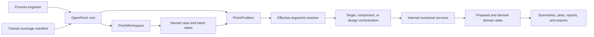

# Package Usability Refactor Application Design

## Design Scope

This design implements the approved process-engineer experience without
changing OpenPinch into a service or adding a second public abstraction layer.
`PinchProblem` remains the single-study facade and `PinchWorkspace` remains the
named-study facade. Descriptor-backed accessors organize capabilities, internal
services retain numerical ownership, and Pydantic models remain serializable
data contracts.

## Components and Responsibilities

| Component | Responsibility |
|---|---|
| Root facade | Export exactly `PinchProblem` and `PinchWorkspace`. |
| Problem lifecycle | Load, validate, configure, serialize, and invalidate without analysis. |
| Target accessors | Expose explicit heat-integration and advanced targeting vocabulary. |
| All-period target accessors | Mirror supported target methods without method strings. |
| Effective-argument resolver | Apply named argument, options, config, and default precedence with provenance. |
| Component accessor | Add process MVR and invalidate derived state without solving. |
| Design accessor and view | Run named HEN methods and provide ranked network/grid behavior. |
| Observation accessors | Read summaries, metrics, reports, plots, comparisons, and exports without execution. |
| Workspace case and batch views | Create scenarios and mirror problem operations over ordered named cases. |
| Tutorial/RTD manifest | Prove executable coverage and render one canonical public map. |

## Public Interaction Rules

1. Method names select algorithms. OpenPinch-owned closed string selectors are
   absent from normal signatures.
2. `carnot_heat_pump()` and `carnot_refrigeration()` distinguish fast Carnot
   screening from vapour-compression, Brayton, and MVR simulation.
3. Booleans represent only independent binary decisions. Unsupported algorithm
   combinations do not exist as valid call shapes.
4. Exactly one effective HPR load form is permitted: fraction, duty, or period
   mapping.
5. Explicit arguments override advanced options, stored configuration, and
   library defaults without mutating the stored case.
6. Configuration stores engineering assumptions, never which public method to
   run.
7. Loading and persistent mutation invalidate dependent state. Observation and
   export methods never create it.
8. Strings remain valid for open-world identities and external resources.

## Primary Interfaces

### Targeting

The target accessor provides focused direct, indirect/Total Site, full
heat-integration traversal, area/cost, model-specific HPR, model-specific
cogeneration, exergy, and energy-transfer methods. Every supported multiperiod
operation appears under `target.all_periods` with the same name and arguments
plus an integer worker count.

The accessor is not callable. `all_heat_integration()` replaces the old unnamed
call while preserving its efficient dependency-aware traversal.

### Design and components

`components.add_process_mvr()` is the sole process-MVR mutation entry.
`design.heat_exchanger_network()`,
`enhanced_heat_exchanger_network()`,
`multiperiod_heat_exchanger_network()`, `open_hens()`, `pinch_design()`,
`thermal_derivative()`, and `network_evolution()` encode design algorithms and
period scope through method names. HEN results remain serializable; ranking,
selection, metrics, and grid rendering live on an application-owned view.

### Workspace

`scenario()` produces an unsolved `PinchProblem`. `cases()` produces an ordered
batch view with mirrored target and design accessors. This avoids workflow
strings and makes single-case examples transferable directly to case studies.

### Observation and output

Summary, metric, report, comparison, plot, Excel, and dashboard methods consume
existing state. Two aggregation booleans encode the four meaningful period
views. Named plot methods select graph families, and exports receive plot
method references.

## Orchestration and Data Flow

Text alternative: the engineer starts with a problem or workspace. Workspace
views materialize problems. Explicit method calls resolve effective arguments,
then coordinate an internal numerical service and store derived state.
Observation consumes that state. Tutorials and RTD pages exercise only the root
facade and are checked against the coverage manifest.

## State Model

| Operation | Resulting state | Invalidation or execution rule |
|---|---|---|
| construct, load, validate | prepared | no analysis |
| persistent config or component mutation | prepared | clear target, period, design, graph, and report caches |
| focused target | targeted | establish only documented prerequisite |
| all-period target | targeted with ordered period cache | same method and arguments per supported period |
| HEN design | designed | use fixed heat-integration prerequisite only |
| summary, plot, report, comparison | unchanged | fail clearly when required cached state is missing |
| export or dashboard | unchanged | explicit side effect only |

## Live-to-Target Module Migration

The live source inventory confirms that implementation can remain inside the
existing application boundaries. No new top-level package is required.

| Live owner | Current responsibility or issue | Target responsibility |
|---|---|---|
| `application/_problem/accessors/target.py` | callable accessor, direct/indirect HPR spellings, generic options | descriptive focused and all-period method families; no callable shortcut |
| `application/_problem/targeting/plan.py` | config-selected composite workflow | dependency plan for `all_heat_integration()` only; no analysis-selection flags |
| `application/_problem/targeting/execution.py` | focused execution and prerequisite lookup | explicit target execution with effective-argument metadata |
| new `application/_problem/arguments.py` | not present | omitted sentinel, method specifications, normalization, conflict validation, and provenance |
| `application/problem.py` | top-level period replay, implicit summary solve, redundant serializers | lifecycle/state owner plus observational summaries and descriptor surfaces |
| `application/_problem/periods/execution.py` | generic replay of recorded target | backend used by named `target.all_periods.*` methods |
| `application/_problem/accessors/component.py` | `add_component.process_mvr()` | `components.add_process_mvr()` with invalidation and no solve |
| `application/_problem/accessors/design.py` | method strings and `_method` suffixes | named single-period, enhanced, and multiperiod design methods plus design view |
| `application/_problem/accessors/plot.py` | named plots plus type-string exports | observational catalog/data/plots and callable-selected exports |
| `application/workspace.py` | variant aliases, workflow strings, solving scenario option | case vocabulary, unsolved scenarios, active forwarding, and `cases()` batch view |
| `application/_workspace/execution.py` | string workflow dispatcher | typed batch invocation and structured per-case outcome collection |
| `contracts/workspace.py` | variant/workflow persistence contracts | case-oriented bundle contracts without a configured core-method selector |
| `contracts/configuration.py` and samples | analysis-enable and method-sequence values | numerical assumptions only; removed selectors rejected |
| `data/notebooks` and `docs` | ten partially stale examples | eighteen executable study templates and generated RTD coverage map |
| notebook and architecture tests | substring and obsolete-syntax assertions | live inventory, AST, execution-profile, state, and coverage-manifest contracts |

Implementation order follows dependency direction: argument/state primitives,
targeting, components/design/workspace, observation/presentation, then tutorials
and documentation. This keeps each migration step testable without preserving
legacy public aliases.

## Tutorial Architecture

The eighteen tutorials form reusable study templates rather than feature
demos. Each follows construct or load, validate, explicitly execute, inspect,
interpret, and optionally export. Core templates cover first solve, Total Site,
multi-segment input, scenarios, persistence, and multiperiod heat integration.
Advanced templates cover area/cost/exergy, Carnot HPR, simulated/Brayton HPR,
multiperiod HPR, process MVR, selected and multiperiod cogeneration, energy
transfer, selected/advanced/multiperiod HEN, and results/publication.

One CSV manifest records every public operation, semantic mode, tutorial owner,
dependency profile, and status. CI compares it with the live inventory and
executable notebook AST. Sphinx renders the same records on Read the Docs.

## Consistency Validation

- All five usability user stories map to one or more components and tutorials.
- The public root contains exactly two classes.
- Every algorithm selector is a method name or documented default, not a
  normal string argument or execution-selection config key.
- Every mutating, executing, observational, and side-effecting method has an
  explicit state rule.
- Every supported public operation and semantic mode has a tutorial owner.
- The design preserves numerical services and transport-schema serialization
  boundaries.
- Security and Resiliency extensions are disabled. Partial property-based
  testing applies to argument normalization, period ordering, aggregation, and
  manifest resolution.
