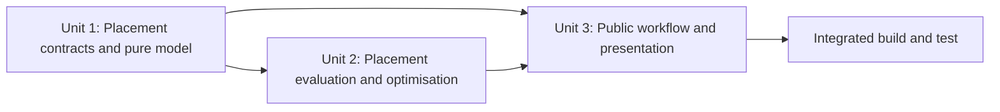

# Unit Dependencies

| Unit | Depends on | Delivery order |
|---|---|---:|
| Domain and Input | Existing value, stream, schema, and preparation layers | 1 |
| Targeting and Integration | Domain and Input | 2 |
| Heat Exchanger Network | Domain and Input; Targeting and Integration | 3 |

## Package Usability Refactor Dependencies

| Unit | Direct dependencies | Why |
|---|---|---|
| 1. Contract and Correctness Foundation | approved requirements and design | Defines the contract and regression evidence consumed by every later unit. |
| 2. PinchProblem Interaction, Targeting, and Configuration | Unit 1 | Implements the frozen problem-level contract and state primitives. |
| 3. Components, Design, Workspace, and Presentation | Units 1 and 2 | Mirrors the problem vocabulary and consumes its resolver/state model. |
| 4. Capability-Complete Tutorial Suite | Units 1, 2, and 3 | Teaches only completed canonical workflows and return views. |
| 5. Documentation and Executable Quality Gates | Units 1, 2, 3, and 4 | Publishes and verifies the final live API and executable tutorial corpus. |

The graph is acyclic and has one implementation order: 1, 2, 3, 4, 5. Units
are logical construction boundaries inside one distributable package, not
independently deployable services. A later unit may reveal a defect in an
earlier contract, but the correction is applied to the owning earlier unit and
its regression tests before downstream work continues.

## Repository Issue Remediation Dependencies

| Unit | Direct dependencies | Downstream consumers | Delivery order |
|---|---|---|---:|
| 1. Application State and Filesystem Contracts | approved requirements and Application Design | Unit 3 documentation and repository gates | 1 |
| 2. Exact OpenHENS Checkout Loading | approved requirements and Application Design | Unit 3 documentation and repository gates | 2 |
| 3. Current Documentation and Drift Guards | final Unit 1 and Unit 2 contracts | final build/test evidence | 3 |

### Update Strategy

- **Approach**: logically parallel Unit 1 and Unit 2 ownership with sequential
  implementation and review for diagnostic clarity.
- **Critical path**: Unit 1, Unit 2, then Unit 3 and repository-wide gates.
- **Coordination points**: architecture/stale-symbol tests and final package
  verification consume both runtime units.
- **Rollback**: each unit is independently revertible; Unit 3 documentation is
  reverted with whichever runtime unit contract is reverted.
- **Deployment**: one wheel/source distribution after all units; no independent
  deployment or version skew is supported.

### Testing Checkpoints

1. Unit 1 focused application, contract, property, and reporting tests.
2. Unit 2 isolated import/cache and comparison prerequisite tests.
3. Unit 3 stale-symbol, architecture, documentation, packaging, and wheel tests.
4. Complete fixed-seed non-solver and repository quality gates after all units.

The graph is acyclic: Units 1 and 2 depend only on approved inception artifacts;
Unit 3 depends on both runtime units; no edge returns to an earlier unit.

## Utility Placement Optimisation Dependencies

### Dependency matrix

Rows consume columns. `Required` means the provider's construction exit gate
must pass before the consumer begins production integration.

| Consumer | Unit 1: Contracts/model | Unit 2: Evaluation/service | Unit 3: Public integration |
|---|---|---|---|
| Unit 1: Contracts/model | Self | None | None |
| Unit 2: Evaluation/service | Required | Self | None |
| Unit 3: Public integration | Required | Required | Self |

External owners are dependencies, not new units: Unit 2 composes existing
direct and Total Site targeting, solver-neutral optimisation, and steam-turbine
calculation; Unit 3 composes existing application, workspace, presentation,
documentation, and packaging owners. Their existing public behavior remains a
regression contract.

### Validated dependency flow

The Mermaid graph was validated before insertion: it contains four declared
nodes, four edges, quoted labels, balanced fences, and no edge to an undeclared
identifier.

Text alternative: Unit 1 provides stable contracts and pure models to Units 2
and 3. Unit 2 adds the complete numerical placement service and provides it to
Unit 3. Unit 3 integrates the public workflows and presentation behavior. The
integrated build-and-test gate runs after Unit 3.

### Critical path and update strategy

1. **Unit 1 first**: stabilize schemas, errors, vector order, serialization,
   strategies, and pure invariants.
2. **Unit 2 second**: implement period context, coverage and objectives against
   Unit 1 contracts, then add bounded optimisation and alternatives.
3. **Unit 3 third**: integrate completed contracts/service with problem,
   all-period, batch, observation, reporting, the single executable notebook,
   tutorial manifest, and packaging owners. No CLI owner is involved.
4. **Integrated gate**: run the complete unit, cross-unit, fixed-seed PBT,
   architecture, compatibility, docs, packaging, and distribution checks.

The implementation sequence is deliberately contract-first. Non-blocking
analytical fixtures may be prepared early, and documentation outlines may be
drafted after Unit 1, but production code cannot consume a temporary interface.

### Coordination points

| Boundary | Provider | Consumer | Stabilization evidence |
|---|---|---|---|
| Request/template/result schema and exception taxonomy | Unit 1 | Units 2 and 3 | Validation, JSON round-trip, import, and error-contract tests |
| Decision-vector coordinate order and model bounds | Unit 1 | Unit 2 | Encode/decode and bounds properties |
| Complete detached service entry point | Unit 2 | Unit 3 | Direct/Total Site, multiperiod, objective, alternatives, and typed-failure tests |
| Result observation contract | Units 1 and 2 | Unit 3 | No-private-state and no-hidden-execution tests |
| Existing target/turbine/optimiser adapters | Existing owners | Unit 2 | Focused adapter and regression tests |
| Existing application/batch/presentation owners | Existing owners | Unit 3 | Accessor, batch, reporting, and compatibility tests |
| Existing notebook generator/manifest/package-data owners | Existing owners | Unit 3 | Generated notebook execution, manifest registration, and distribution inclusion |

### Testing checkpoints

1. **Unit 1 checkpoint**: contract examples; validation taxonomy; vector and
   serialization round-trips; ordering, span, bounds, copy, and generator
   properties; no import-cycle or root-export regression.
2. **Unit 2 checkpoint**: analytical entropy and monetary examples; hot/cold
   coverage and weighted-sum invariants; direct/Total Site replay; eligible
   cogeneration boundary; penalty ordering; structured-grid oracle; bounded
   fixed-seed solve and typed exhaustion.
3. **Unit 3 checkpoint**: problem/all-period/batch APIs; period and case order;
   source-state preservation on success/failure; result-only reporting; JSON
   through public APIs; specialist imports; clean execution of the generated
   thermodynamic and monetary/cogeneration notebook; tutorial manifest,
   package-data, docs, and installed-package smoke.
4. **Integrated checkpoint**: all focused and cross-unit tests, fixed-seed PBT,
   complete non-solver regressions, Ruff, architecture checks, documentation,
   build, wheel/source installation, and package smoke.

### Acyclicity and rollback validation

- The topological order is uniquely compatible with production integration:
  Unit 1, Unit 2, Unit 3.
- No unit imports a later unit and no existing owner imports the application
  layer through the new analysis service.
- Unit 3 may be reverted without removing Unit 1/2 specialist internals; Unit 2
  and its Unit 3 exposure revert together if its contracts remain unused;
  Unit 1 reverts last after all consumers are removed.
- All units ship together; version skew and independent deployment are out of
  scope.
