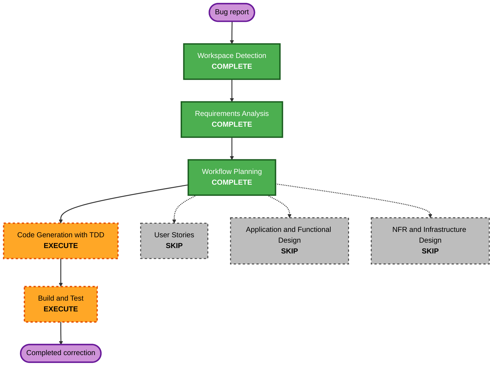

# Pull-Request Automatic Version-Bump Ordering Execution Plan

## Detailed Analysis Summary

- **Transformation type**: Isolated correction within the existing GitHub
  Actions delivery component.
- **Primary changes**: Restore automatic version advancement, establish an
  explicit bump-to-validation dependency, and validate the latest PR head.
- **Related components**: Packaging workflow tests and release-process
  documentation.
- **User-facing change**: Maintainers no longer need to make a manual version
  commit before merging a same-repository pull request to `main`.
- **Structural, data-model, and API changes**: None.
- **Risk level**: Medium because workflow mutation changes the PR head while a
  run is active; rollback is a single workflow commit, and explicit latest-head
  validation plus deterministic convergence tests reduce risk.

## Component Relationships

- **Primary component**: `.github/workflows/ci-pull-request.yml`.
- **Supporting components**: `.bumpversion.toml`, `pyproject.toml`, `uv.lock`,
  and `scripts/check_release_version.py`.
- **Dependent components**: `pr-gate` and the main-branch publication workflow.
- **Verification component**: `tests/packaging/test_packaging_metadata.py`.

## Workflow Visualization

Text alternative: workspace detection and minimal requirements are complete.
The approved path proceeds directly through TDD code generation and Build and
Test. User Stories, application and functional design, NFR work, infrastructure
design, and operations are skipped.

## Stage Plan

### Inception

- [x] Workspace Detection - existing brownfield project and current reverse
  engineering artifacts confirmed.
- [x] Reverse Engineering - reused current artifacts; refresh not required.
- [x] Requirements Analysis - minimal requirements approved.
- [x] User Stories - skipped because this is an internal CI bug with one actor
  and explicit acceptance criteria.
- [x] Workflow Planning - focused execution path approved by standing user
  authorization.
- [x] Application Design - skipped; no service or component boundary changes.
- [x] Units Generation - skipped; this is one straightforward workflow unit.

### Construction

- [x] Functional Design - skipped; workflow rules are fully specified in the
  requirements.
- [x] NFR Requirements and Design - skipped; existing least-privilege and
  reproducibility standards are sufficient.
- [x] Infrastructure Design - skipped; no deployed resources are introduced.
- [x] Code Generation - completed the six-step TDD correction plan.
- [x] Build and Test - completed focused workflow tests, YAML validation, lint,
  documentation, and the appropriate regression suite.

### Operations

- [x] Operations - N/A; no deployment or monitoring change is requested.

## Package Change Sequence

1. Add Red workflow contract assertions.
2. Correct PR workflow mutation and dependency ordering.
3. Update release-process documentation.
4. Run integrated packaging and repository verification.

## Success Criteria

- Equal same-repository PR versions advance exactly once before validation.
- The validator reads the latest PR head and proves it exceeds the base.
- Forward versions do not bump again; stale versions fail closed.
- Forks remain read-only and develop-targeting PRs remain unchanged.
- Static workflow contracts, YAML parsing, documentation, and regressions pass.
