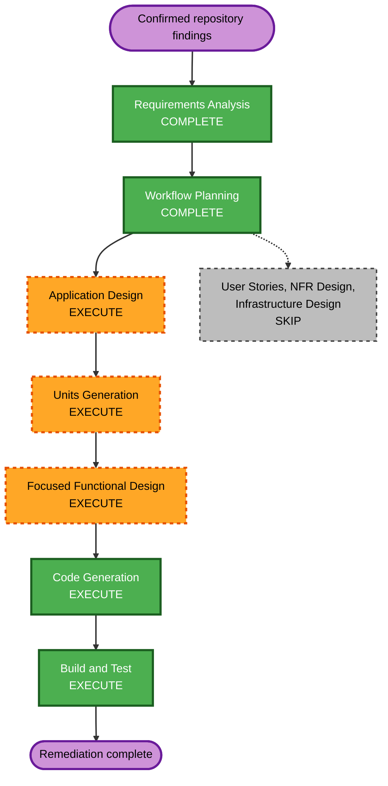

# Repository Issue Remediation Execution Plan

## Detailed Analysis Summary

- **Transformation type**: Bounded multi-component correctness remediation.
- **Risk level**: Medium.
- **Rollback complexity**: Easy per commit because no persisted schema version,
  solver model, or external service changes are required.
- **Testing complexity**: Moderate because filesystem, concurrency, interpreter
  module state, Pydantic bundle validation, and cached application state are
  involved.
- **User-facing impact**: Clearer invalid-case-name errors, unique export files,
  consistent unloaded-problem errors, and accurate current documentation.
- **Structural impact**: One shared workspace case-name validator and one exact
  OpenHENS import context; no new public package-root names.
- **Data-model impact**: Workspace bundle case keys and `baseline_name` gain
  stricter validation without a schema-version change.
- **NFR impact**: Filesystem containment, concurrent export reliability, and
  deterministic external-checkout identity are strengthened.

## Component Relationships

- **Application state**: `PinchProblem` owns authoritative input and prepared
  runtime state; `PinchWorkspace` delegates active-case observation and manages
  named inputs.
- **Workspace contracts**: `PinchWorkspaceBundle` validates persisted case keys
  before the application layer constructs live cases.
- **Reporting**: workbook export receives a destination from application
  orchestration and owns unique file allocation.
- **Comparison tooling**: the OpenHENS comparison script owns external checkout
  discovery, validation, and execution.
- **Documentation**: AI-DLC state and reverse-engineering artifacts describe the
  supported package contract and are guarded by repository tests.

## Workflow Visualization

Text alternative: confirmed findings proceed through completed requirements and
workflow planning, then minimal Application Design, focused unit decomposition,
functional design, code generation, and build/test. User Stories, NFR Design,
and Infrastructure Design are skipped because the fixes remain inside existing
component boundaries and introduce no infrastructure.

## Phase Decisions

### Inception

- [x] Workspace Detection - reused the current brownfield workspace assessment.
- [x] Reverse Engineering - reused current artifacts; their stale API statements
  are themselves part of the remediation scope.
- [x] Requirements Analysis - completed at standard depth from six reproduced
  findings and the approved clean-break direction.
- [x] User Stories - skipped because these are bounded bug fixes for the single
  existing process-engineer persona.
- [x] Workflow Planning - this dependency-ordered plan.
- [x] Application Design - execute minimally because Units Generation requires
  an approved component and dependency definition. Existing public component
  boundaries are retained; design artifacts are generated and awaiting review.
- [x] Units Generation - completed with three coherent
  implementation units.

### Construction

- [x] Functional Design - Unit 1 and Unit 2 designs completed and approved;
  Unit 3 correctly skipped as documentation-only.
- [x] NFR Requirements - skipped; the applicable safety and reliability constraints
  are explicit in the requirements and use existing platform capabilities.
- [x] NFR Design - skipped with NFR Requirements.
- [x] Infrastructure Design - skipped; no deployment or infrastructure change.
- [x] Code Generation - all three units implemented and approved under the
  user's completion authorization.
- [x] Build and Test - all required gates passed.

### Operations

- [x] Operations - N/A; no deployment, monitoring, or runtime service change.

## Units and Dependency Order

### Unit 1: Application state and filesystem contracts

This unit runs first because its case-name and state contracts affect workspace,
bundle, export, and reporting tests.

1. Shared case-name validation and bundle enforcement.
2. Batch export containment.
3. Detached `problem_data` snapshots.
4. Prepared-root guard for multiplier changes.
5. Collision-free workbook allocation.

### Unit 2: Exact OpenHENS checkout loading

This unit is independent of Unit 1 at runtime but follows it to keep shared
interpreter-state tests isolated and easy to diagnose.

1. Exact-checkout import context.
2. Module-origin verification.
3. Verified callable injection into comparison execution.
4. Import-state restoration tests.

### Unit 3: Current documentation and drift guards

This unit runs after code contracts settle so documentation describes the final
surface once.

1. Refresh active AI-DLC state.
2. Refresh reverse-engineering business, architecture, structure, inventory, and
   API documents.
3. Add scoped stale-symbol assertions.
4. Build warning-free Sphinx documentation.

## Detailed Code Generation Checklist

### 1. Establish regression tests before implementation

- [x] Add a `problem_data` mutation regression for mapping input.
- [x] Add a `problem_data` mutation regression for `TargetInput` input.
- [x] Add the equivalent active-workspace snapshot regression.
- [x] Add empty and lazily rebuilt `set_dt_cont_multiplier` tests.
- [x] Add unsafe runtime case-name parameterization.
- [x] Add invalid workspace-bundle key and `baseline_name` tests.
- [x] Add batch export containment tests using POSIX and Windows-style hostile
  identifiers.
- [x] Add fixed-seed generated case-name tests that assert accepted identifiers
  remain a single path component and rejected identifiers never reach export.
- [x] Add same-timestamp and concurrent workbook allocation tests.
- [x] Add failed-workbook cleanup coverage.
- [x] Add cached-foreign-module and requested-checkout OpenHENS tests.
- [x] Add `sys.path` and `sys.modules` restoration tests for success and failure.

### 2. Implement canonical workspace case-name validation

- [x] Define one validator in `OpenPinch/contracts/workspace.py` for non-empty,
  trimmed, portable single-component case identifiers.
- [x] Apply it to bundle `baseline_name` and every key in `cases`.
- [x] Reuse it from `PinchWorkspace.__init__`, `load`, `_set_case_input`, scenario
  creation, and any other case-creation boundary.
- [x] Preserve original valid identifier strings as mapping keys and display
  labels; do not silently sanitize invalid identifiers.
- [x] Replace batch export string interpolation with standard-library path
  composition that preserves the application dependency boundary.
- [x] Resolve the export root and case directory and enforce common-path
  containment before writing.
- [x] Preserve batch error isolation by recording validation/export failures in
  `CaseBatchResult.errors`.

### 3. Isolate authoritative problem input

- [x] Return `deepcopy(self._problem_data)` from `PinchProblem.problem_data`.
- [x] Update its documentation to state that the result is a detached snapshot.
- [x] Confirm `PinchWorkspace.problem_data` requires no additional copying after
  delegation.
- [x] Keep `to_problem_json()` as the canonical validated JSON-compatible view.
- [x] Verify no internal caller relies on mutating the property return value.

### 4. Normalize multiplier guard behavior

- [x] Resolve `root_zone = self._require_prepared_root_zone()` before zone lookup.
- [x] Apply the multiplier through `root_zone.get_subzone(zone_name)`.
- [x] Clear cached targets and period results exactly as today.
- [x] Return `root_zone` and preserve lazy rebuilding for loaded inputs.

### 5. Allocate workbook paths atomically

- [x] Replace `_compose_output_path` with a private exclusive-allocation helper.
- [x] Retain sanitized project prefix, readable timestamp, and `.xlsx` suffix.
- [x] Use standard-library exclusive creation so concurrent processes cannot
  claim the same path.
- [x] Wrap Excel writing so failures remove the reserved partial file.
- [x] Preserve the successful export return type and workbook contents.

### 6. Bind OpenHENS execution to one checkout

- [x] Replace `_require_supported_openhens` with an exact-checkout import context.
- [x] Snapshot and remove all `openhens` and `openhens.*` entries before import.
- [x] Temporarily place the resolved checkout at the front of `sys.path` and
  invalidate import caches.
- [x] Import and validate the required capability modules.
- [x] Verify resolved module files are beneath `openhens_root`; reject missing or
  foreign origins with an actionable error.
- [x] Pass the verified `OpenHENS` callable into source execution.
- [x] Restore the original module cache and path on every exit path.
- [x] Ensure output directories are still not created when prerequisite loading
  fails.

### 7. Refresh active documentation

- [x] Correct the top-level current status in `aidlc-docs/aidlc-state.md`.
- [x] Update current reverse-engineering architecture, component inventory,
  business overview, code structure, and API documentation.
- [x] Preserve audit history and clearly historical plan/build records.
- [x] Remove the ignored local `docs/_build` output before documentation
  verification so deleted pages cannot mask current source state.
- [x] Add a scoped AST/text guard for retired API statements in active docs.
- [x] Record implementation, test, state, and audit artifacts with same-turn
  checkbox updates.

## Expected File Impact

### Production and tooling

- `OpenPinch/application/problem.py`
- `OpenPinch/application/workspace.py`
- `OpenPinch/contracts/workspace.py`
- `OpenPinch/presentation/reporting/workbook.py`
- `scripts/compare_openhens_openpinch_top5.py`

### Tests

- `tests/application/test_pinch_problem.py`
- `tests/application/test_pinch_workspace.py`
- `tests/presentation/test_workbook_reporting.py`
- `tests/packaging/test_openhens_comparison_prerequisite.py`
- relevant architecture or stale-symbol contract test module

### Current documentation and AI-DLC artifacts

- `aidlc-docs/aidlc-state.md`
- `aidlc-docs/inception/reverse-engineering/architecture.md`
- `aidlc-docs/inception/reverse-engineering/business-overview.md`
- `aidlc-docs/inception/reverse-engineering/code-structure.md`
- `aidlc-docs/inception/reverse-engineering/component-inventory.md`
- `aidlc-docs/inception/reverse-engineering/api-documentation.md`
- new construction plans, summaries, build/test instructions, and audit entries

## Verification Gates

### Focused gates

- [x] Run problem and workspace application tests.
- [x] Run workspace bundle and closed-contract tests.
- [x] Run workbook reporting tests, including concurrency and cleanup.
- [x] Run OpenHENS prerequisite and comparison-script tests.
- [x] Run architecture, import-boundary, and stale-symbol tests.

### Repository gates

- [x] Run the complete fixed-seed non-solver suite.
- [x] Run relevant opt-in OpenHENS/HEN checks that do not alter external source
  checkouts.
- [x] Run `ruff check .` and `ruff format --check .`.
- [x] Build Sphinx with warnings treated as errors from a clean output tree.
- [x] Build wheel and source distributions.
- [x] Install the wheel in isolation and smoke-test only canonical root imports.
- [x] Run `git diff --check` and stale-file checks.
- [x] Confirm no application artifacts were written beneath `aidlc-docs/`.

## Success Criteria

- All six original reproductions are closed by focused tests.
- Raw case identifiers cannot influence filesystem traversal.
- Public input observation cannot desynchronize runtime and serialized state.
- OpenHENS comparisons prove checkout identity before execution.
- Workbook exports cannot collide under repeated or concurrent allocation.
- Public empty-state errors are consistent and actionable.
- Current documentation describes only the canonical root API.
- All focused and repository verification gates pass without warnings.
