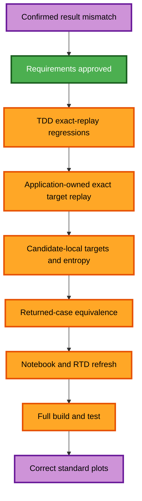

# Utility Placement Exact-Target Replay Execution Plan

## Detailed analysis

- Change type: high-risk numerical bug fix across application targeting,
  utility-placement evaluation, contracts, returned-case integration, tests,
  notebook 19, and RTD.
- Root cause: optimizer allocation and ordinary retargeting use different
  hierarchy models; unpersisted duty coordinates further change allocation.
- Public API: unchanged. Levels remain candidate utilities and may receive zero
  duty. No minimum-duty API is added.
- Dependency direction: application code owns detached `PinchProblem` replay;
  pure analysis consumes an injected exact-replay result and does not import the
  application layer.
- Rollback: revert the focused correction commit without changing persisted
  user data.

## Workflow visualization

Text alternative: approve requirements; add failing exact-replay tests;
implement the application adapter; calculate candidate-local targets and
entropy; prove returned-case equivalence; refresh notebook and RTD; run all
quality gates.

## Stages

- Requirements Analysis: complete after approval of the recorded answers.
- User Stories: skipped because this is a confirmed bug in an existing workflow.
- Application Design: minimal execution for the application-to-analysis replay
  boundary and candidate result ownership.
- Units Generation: skipped because this is one cohesive correction unit.
- Functional Design: minimal execution for exact replay, candidate-local target
  semantics, and returned-case equality.
- NFR Requirements and Design: minimal execution for replay cost, bounded
  evaluation, deterministic behavior, and source isolation.
- Infrastructure Design: skipped; there is no infrastructure change.
- Code Generation: execute using TDD.
- Build and Test: execute focused, notebook, documentation, packaging,
  performance, and complete solver-enabled gates.
- Operations: N/A; no deployment change is requested.

## TDD code-generation sequence

- [x] Step 1 — Add RED Process and Total Site regressions comparing optimizer
  evidence with ordinary retargeted duties and graph data.
- [x] Step 2 — Remove independent duty coordinates that cannot survive normal
  case replay while preserving bounded structurally ordered temperatures.
- [x] Step 3 — Add an application-owned detached exact-target replay adapter for
  Process, Site, Community, and Region scopes without source mutation.
- [x] Step 4 — Carry candidate-specific target totals, utility matching, profile
  snapshots, and named/fallback duties into coverage and entropy evaluation.
- [x] Step 5 — Make returned-case retargeting reproduce the evidence selected by
  the optimizer for every period and hierarchy scope.
- [x] Step 6 — Run focused and property gates; refactor only while green and
  measure the added replay cost against bounded execution requirements.
- [x] Step 7 — Regenerate and execute notebook 19; verify standard GCC/TSP data
  matches the ranked allocation; update RTD and requirements evidence.
- [x] Step 8 — Run Ruff, patch hygiene, Sphinx, packaging, notebook, performance,
  and complete solver-enabled suites; review and commit only owned files.

## Success criteria

- Exact per-name optimizer/retarget duty equality for Process and Total Site.
- Candidate-local Total Site net targets and entropy after ordinary hierarchy
  aggregation and same-level matching.
- Candidate levels may remain at zero duty and no minimum-duty API is added.
- Source state remains unchanged; public API and standard plot methods remain
  unchanged.
- All focused and complete quality gates pass.
