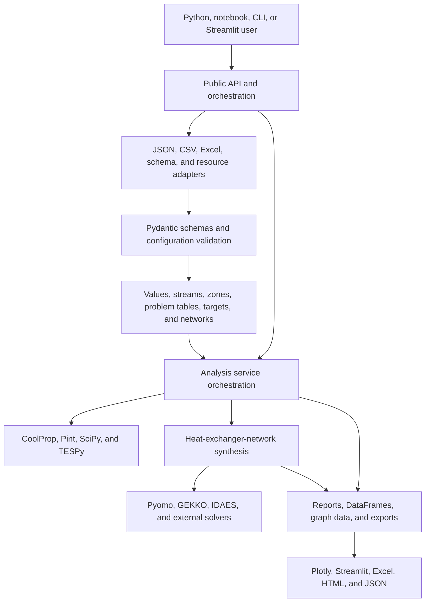
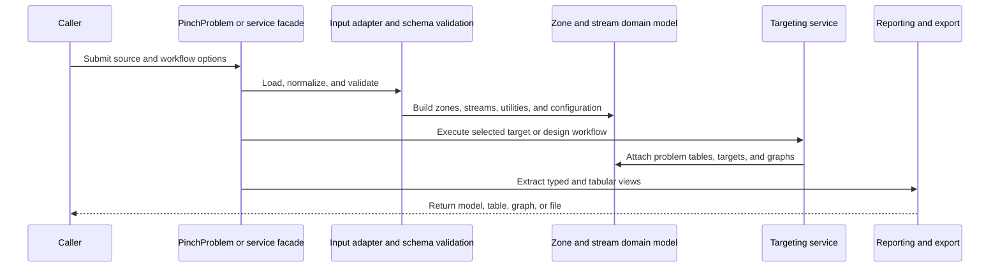

# System Architecture

## System Overview

OpenPinch is a single distributable Python package with a layered internal architecture. Public orchestration objects sit above input adapters and Pydantic schemas. Those adapters create a mutable domain graph of zones, streams, utilities, problem tables, and targets. Service modules perform numerical analysis and optional optimization. Reporting and presentation modules convert the resulting graph into typed responses, tables, files, and interactive visualizations.

The project is a library rather than a deployed network service. It has no REST server, database, cloud stack, or persistent daemon. Persistence is file-based, and solver-backed workflows execute locally through optional Python packages and external solver binaries.

## Architecture Diagram

Text alternative: users call public orchestration APIs. Input adapters and schemas create validated domain objects. Analysis services use thermodynamic libraries and optional HEN solvers. Reporting and presentation layers convert results into typed data, tables, graphs, dashboards, and files.

## Component Descriptions

### `OpenPinch.__init__`, `main`, and `__main__`

- **Purpose**: curated package exports, typed service boundary, and CLI entry point.
- **Responsibilities**: expose supported public names, map `TargetInput` to `TargetOutput`, and copy packaged notebooks.
- **Dependencies**: classes, schemas, resources, and service facade.
- **Type**: application facade.

### `OpenPinch.classes`

- **Purpose**: domain objects and high-level orchestration.
- **Responsibilities**: problem/workspace lifecycle, values and units, streams and collections, zone hierarchy, problem tables, exchangers, networks, accessors, validation, result extraction, and views.
- **Dependencies**: schemas, configuration, input adapters, services, pandas, Pydantic, and Pint.
- **Type**: application and domain model.

### `OpenPinch.lib`

- **Purpose**: configuration, enums, unit policy, schema contracts, and shared type definitions.
- **Responsibilities**: validate flat options, define serializable request/response models, normalize output units, and centralize target and graph vocabulary.
- **Dependencies**: Pydantic, Pint, and selected domain classes for runtime target schemas.
- **Type**: shared models and policy.

### `OpenPinch.services.common`

- **Purpose**: reusable thermal-analysis operations.
- **Responsibilities**: utility targeting, problem-table analysis, graph construction, cost and area targeting, temperature driving force, and service orchestration.
- **Dependencies**: domain model, NumPy, pandas, and SciPy.
- **Type**: shared service layer.

### Integration and post-processing services

- **Purpose**: direct integration, indirect integration, energy-transfer analysis, exergy, cogeneration, process components, and controllability.
- **Responsibilities**: execute specialized business transactions on zones and attach target results.
- **Dependencies**: shared services, schemas, thermodynamic models, and configuration.
- **Type**: application services.

### Heat-pump integration

- **Purpose**: screen and simulate heat-pump, refrigeration, MVR, cascade, parallel, multiperiod, and Brayton configurations.
- **Responsibilities**: preprocess targets, encode optimizer variables, solve thermodynamic unit models, select loads, and post-process cost and graph effects.
- **Dependencies**: CoolProp, SciPy, NumPy, optional TESPy, and black-box optimizers.
- **Type**: advanced numerical service.

### Heat-exchanger-network synthesis

- **Purpose**: produce, verify, rank, and report exchanger-network candidates.
- **Responsibilities**: construct synthesis tasks, map data to solver arrays, implement stagewise and pinch-decomposition models, manage execution pathways and fallbacks, assemble results, and export manifests.
- **Dependencies**: optional Pyomo, GEKKO, IDAES, external solvers, NumPy, pandas, and domain schemas.
- **Type**: optional optimization subsystem.

### Network-grid diagram

- **Purpose**: render synthesized networks.
- **Responsibilities**: build a renderable intermediate model and produce Plotly or Matplotlib-compatible grid diagrams.
- **Dependencies**: HEN schemas and optional plotting libraries.
- **Type**: presentation service.

### Utilities, resources, and data

- **Purpose**: file conversion, validation helpers, optimization adapters, exports, packaged notebooks, and sample cases.
- **Responsibilities**: bridge external file formats and learning assets to the core model.
- **Dependencies**: optional Excel and plotting packages plus standard library resources APIs.
- **Type**: adapters and shared utilities.

## Data Flow

Text alternative: the caller submits a source and options; the facade loads and validates it; adapters build the domain model; a selected service attaches results; reporting extracts a typed, tabular, graphical, or file output.

## Integration Points

- **External APIs**: none at runtime. Documentation builds fetch Python, NumPy, and pandas intersphinx inventories.
- **Databases**: none.
- **File formats**: JSON, CSV, XLSB/XLSX, HTML, JSON manifests, pickle artifacts produced by some external or experimental solver workflows, and workspace bundle JSON.
- **Thermodynamic engines**: CoolProp by default; TESPy for optional Brayton-cycle functionality.
- **Optimization engines**: SciPy and internal black-box minimizers; optional Pyomo, GEKKO, IDAES, and system-installed solver binaries for HEN synthesis.
- **Presentation**: pandas, Plotly, Streamlit, openpyxl, and pyxlsb.

## Infrastructure Components

- **Infrastructure as code**: none found.
- **Deployment model**: PyPI wheel and source distribution built by Hatchling; documentation hosted through Read the Docs; source and CI hosted on GitHub.
- **CI/CD**: GitHub Actions for pull requests, the `develop` branch, and version tags; trusted publishing to TestPyPI and PyPI.
- **Networking**: no application network or cloud networking configuration.
- **Persistence**: local files only.

