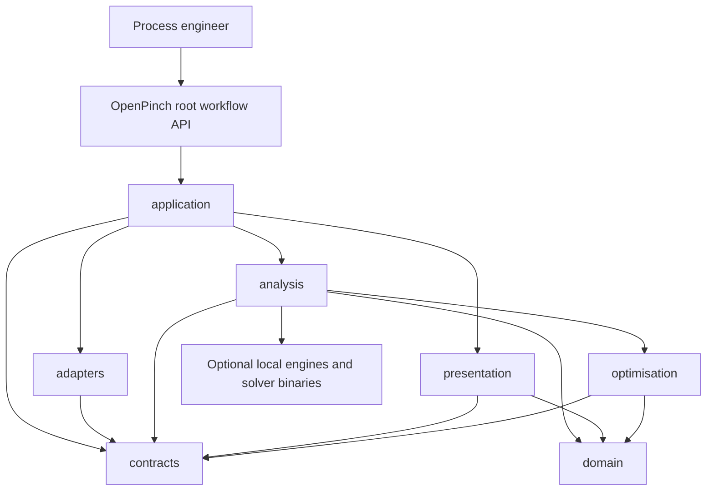
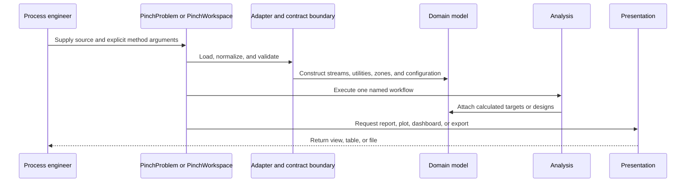

# System Architecture

## System Overview

OpenPinch is one distributable Python library with explicit owner layers. The
package root exposes only `PinchProblem` and `PinchWorkspace`. Application
objects coordinate contracts, adapters, analysis, and presentation while the
domain remains independent of UI and concrete solver backends.

The package has no REST server, database, cloud runtime, or persistent daemon.
Persistence is file-based. Optional solver-backed and thermodynamic workflows
run locally and are guarded at their concrete integration boundaries.

## Architecture Diagram

Text alternative: process engineers enter through the root workflow API. The
application layer coordinates contract and adapter boundaries, analysis, and
presentation. Analysis and optimisation depend on domain and contracts;
optional engines remain behind local integration boundaries.

## Component Descriptions

### Package root and CLI

- `OpenPinch.__init__` imports only the two workflow entry points.
- `OpenPinch.__main__` implements the narrow notebook-copying CLI.
- Package resources expose sample-case and notebook discovery/copy helpers from
  their concrete module.

### `OpenPinch.application`

- Owns problem/workspace lifecycle, effective runtime arguments, targeting,
  component, design and plot accessors, multiperiod replay, summaries,
  comparisons, case batches, and workspace bundle coordination.
- Depends on abstractions and concrete feature owners; it does not own domain
  equations, UI implementation, solver models, or filesystem presentation.

### `OpenPinch.domain`

- Owns values with units, streams and collections, zones, configuration,
  problem tables, targets, fluids, exchangers, and networks.
- Enforces runtime invariants and remains free of presentation, application,
  and concrete optimisation-backend dependencies.

### `OpenPinch.contracts`

- Owns Pydantic input/output, HPR, reporting, graph, turbine, unit, workspace,
  controllability, and synthesis contracts.
- `TargetInput.network` is a transport schema for serialized HEN payloads, not a
  runtime network object.

### `OpenPinch.analysis`

- Owns targeting, heat transfer, economics, numerics, thermodynamics, graphs,
  energy transfer, exergy, power, HPR, and HEN synthesis/verification.
- Solver-backed HEN execution remains under
  `OpenPinch.analysis.heat_exchanger_networks` and uses shared optimisation
  abstractions.

### `OpenPinch.optimisation`

- Owns solver-neutral models, candidates, execution, services, errors, and
  optional backend adapters reusable beyond HPR or HEN.

### `OpenPinch.adapters`

- Owns JSON/CSV/Excel loading, workspace bundles, legacy input conversion, and
  optional dependency checks.

### `OpenPinch.presentation`

- Owns typed/tabular reporting, Excel export, plot construction and galleries,
  Streamlit rendering, and network-grid views.

## Primary Data Flow

Text alternative: a workflow object loads and validates a source, constructs
domain state, invokes one named analysis, then asks presentation owners to
produce a view, table, graph, dashboard, or file.

## Deployment and Integration

- **Distribution**: Hatchling wheel and source archive, validated by repository
  build scripts.
- **Documentation**: Sphinx on Read the Docs.
- **CI/CD**: GitHub Actions and trusted PyPI publishing.
- **Persistence**: local JSON, CSV, Excel, HTML, manifests, and workspace bundle
  files.
- **Thermodynamics**: CoolProp and optional TESPy.
- **Optimisation**: SciPy plus optional Pyomo, GEKKO, IDAES, and provisioned
  external solvers.
