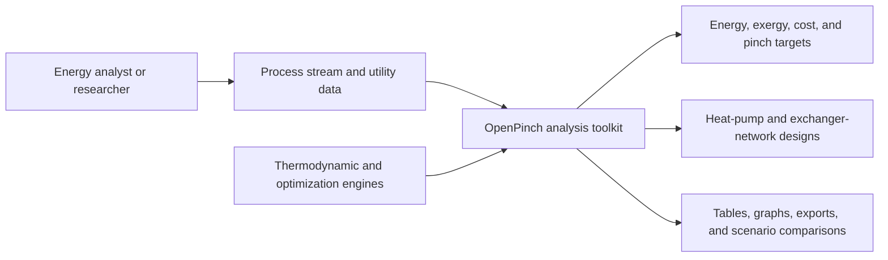

# Business Overview

## Business Context Diagram

Text alternative: an analyst supplies process and utility data to OpenPinch. OpenPinch uses local thermodynamic and optimization engines to produce targets, candidate designs, reports, visualizations, and scenario comparisons.

## Business Description

- **Business Description**: OpenPinch is an open-source process-integration toolkit for reducing industrial energy use and cost. It turns process-stream, utility, operating-period, and equipment assumptions into pinch-analysis targets, Total Site targets, heat-pump and refrigeration opportunities, exergy and cogeneration results, and heat-exchanger-network designs.
- **Primary users**: process-integration researchers, energy engineers, industrial decarbonization analysts, educators, and software teams embedding typed thermal-analysis services.
- **Delivery surfaces**: Python API, typed service function, scenario workspace, packaged notebooks and samples, a narrow notebook-copying CLI, Excel/CSV/JSON adapters, and a Streamlit result viewer.

## Business Transactions

1. **Load and validate a study**: read JSON, Excel, CSV, a Pydantic schema, or an in-memory mapping; normalize units and configuration; build streams, utilities, and a zone hierarchy; return structured validation issues when inputs are invalid.
2. **Calculate direct heat-integration targets**: construct problem tables and composite-curve data, determine pinch temperatures, utility demands, heat-recovery opportunity, area, and cost metrics.
3. **Calculate indirect or Total Site targets**: aggregate zone-level source and sink profiles, form Total Process and Total Site targets, and quantify indirect heat-transfer opportunities.
4. **Screen heat pumps and refrigeration**: evaluate Carnot, vapour-compression, MVR, cascade, parallel, and Brayton configurations against direct or indirect targets, including multiperiod cases.
5. **Evaluate exergy and cogeneration**: enrich compatible heat-integration targets with exergy demand, exergy destruction, turbine work, and efficiency information.
6. **Add process components**: model direct gas or vapour mechanical-vapour-recompression components and convert component results back into streams and work targets.
7. **Synthesize heat-exchanger networks**: convert a solved problem into optimization tasks, execute one or more synthesis methods, verify and rank candidates, and render grid diagrams.
8. **Run scenario studies**: preserve a baseline, create named variants, solve workflows, compare metrics and problem tables, and save or restore workspace bundles.
9. **Publish and inspect results**: return typed outputs, summary DataFrames, Plotly graph data, Streamlit views, Excel exports, HTML graph galleries, manifests, and packaged learning resources.

## Business Dictionary

- **Pinch**: the thermodynamic bottleneck separating above-pinch and below-pinch heat-recovery regions.
- **Stream**: a process or utility flow with supply and target states and thermal duty information.
- **Utility**: external heating or cooling service, optionally with cost and thermophysical properties.
- **Zone**: a hierarchical analysis boundary such as process, plant, site, community, or region.
- **Direct integration**: heat recovery between process streams without an intermediate utility system.
- **Indirect integration**: heat recovery coordinated through utilities or Total Site source and sink profiles.
- **Target**: a calculated thermodynamic, economic, exergy, cogeneration, or design result for a zone and period.
- **HPR**: heat-pump or refrigeration targeting and simulation.
- **MVR**: mechanical vapour recompression.
- **HEN**: heat-exchanger network.
- **Period**: one operating condition in a multiperiod study, optionally associated with a weight.
- **Scenario**: a named variant of a baseline input and workflow configuration.

## Component-Level Business Descriptions

### Public orchestration

- **Purpose**: provide stable study-level entry points through `PinchProblem`, `PinchWorkspace`, and `pinch_analysis_service`.
- **Responsibilities**: load inputs, validate cases, select workflows, cache results, expose summaries and exports, and coordinate scenario comparison.

### Domain model

- **Purpose**: represent values, streams, utilities, zones, problem tables, targets, exchangers, and networks.
- **Responsibilities**: preserve units and period semantics, enforce invariants, and carry calculated state between services.

### Analysis services

- **Purpose**: implement direct and indirect targeting, exergy, cogeneration, heat pumps, refrigeration, components, and energy-transfer analysis.
- **Responsibilities**: transform a validated zone tree into domain-specific targets and graph data.

### HEN synthesis

- **Purpose**: convert thermal targets into candidate exchanger networks.
- **Responsibilities**: build solver tasks and equations, execute optimization backends, verify feasibility, rank results, and generate design outputs.

### Presentation and resources

- **Purpose**: make analyses reproducible and interpretable.
- **Responsibilities**: package samples and notebooks, expose CLI copying, render dashboards and grid diagrams, and export structured results.

