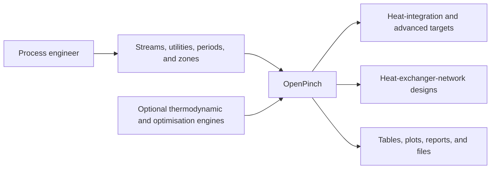

# Business Overview

## Business Context

Text alternative: a process engineer supplies stream, utility, operating-period,
and zone data. OpenPinch uses its numerical core and optional local engines to
produce targets, network designs, and presentation-ready evidence.

## Business Description

OpenPinch is an in-process Python package for industrial process integration.
It helps process engineers quantify direct and indirect heat recovery, Total
Site opportunities, area and cost, heat pumps and refrigeration, exergy,
cogeneration, energy transfer, and heat-exchanger-network designs.

The supported study entry points are `PinchProblem` for one case and
`PinchWorkspace` for named cases. Both are imported from the package root. Input
and result contracts, domain models, and specialised services remain available
from their concrete owner modules for advanced use; they are not package-root
exports.

## Business Transactions

1. **Load and validate a study** from a packaged sample, JSON, CSV, Excel,
   Pydantic contract, or in-memory mapping.
2. **Run heat integration** for direct recovery, indirect recovery, Total Site,
   all zones, or every operating period.
3. **Assess advanced opportunities** for area/cost, heat pumps, refrigeration,
   MVR, exergy, cogeneration, and energy transfer.
4. **Modify a process case** with an explicit process-MVR component and rerun
   affected analyses.
5. **Design a heat-exchanger network** with named single-period, enhanced,
   multiperiod, OpenHENS, pinch, thermal-derivative, or evolution workflows.
6. **Run scenario studies** by creating named workspace cases, executing chosen
   problem methods, comparing results, and saving schema-version-3 bundles.
7. **Publish evidence** through typed results, DataFrames, reports, plots,
   dashboards, Excel workbooks, graph galleries, and JSON serialization.

## Business Dictionary

- **Pinch**: the thermodynamic bottleneck separating above- and below-pinch
  recovery regions.
- **Stream**: a process or utility flow with supply and target states and a
  thermal duty.
- **Zone**: a hierarchical process, plant, site, community, or region boundary.
- **Direct integration**: recovery between process streams in one targeting
  boundary.
- **Indirect integration**: recovery coordinated through utility or Total Site
  source/sink profiles.
- **Target**: a thermodynamic, economic, exergy, power, or transfer result.
- **HPR**: heat-pump or refrigeration analysis.
- **MVR**: mechanical vapour recompression.
- **HEN**: heat-exchanger network.
- **Period**: one operating condition with an optional study weight.
- **Case**: a validated named input owned by a workspace.

## Capability Owners

- **Application** owns `PinchProblem`, `PinchWorkspace`, lifecycle, named
  workflows, state invalidation, and case coordination.
- **Domain** owns values, streams, zones, configuration, problem tables,
  targets, exchangers, and networks.
- **Contracts** owns serialized input, output, reporting, workspace, HPR, and
  synthesis records.
- **Analysis** owns thermal, economic, targeting, HPR, power, exergy, transfer,
  graph, and HEN calculations.
- **Optimisation** owns reusable candidate, model, execution, backend, and error
  abstractions.
- **Adapters** owns file loading, bundle persistence, optional-dependency
  boundaries, and external format conversion.
- **Presentation** owns reports, graphs, dashboards, network grids, and file
  exports.
