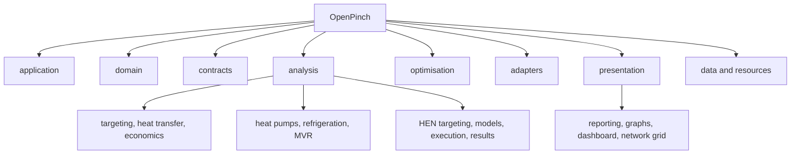

# Code Structure

## Build System

- **Package**: PEP 517 project built with Hatchling from `pyproject.toml`.
- **Environment**: uv with committed `uv.lock` and `.python-version`.
- **Tests**: pytest, marker-separated optional solver profiles, and fixed-seed
  Hypothesis checks where property testing is enabled.
- **Quality**: Ruff lint/format and repository architecture/contract tests.
- **Documentation**: Sphinx through `scripts/build_docs.py`.
- **Distribution**: `scripts/build_dist.py` builds and inspects wheel and source
  archives before isolated smoke testing.

## Current Package Hierarchy

Text alternative: the package is organized by application, domain, contracts,
analysis, optimisation, adapters, presentation, and resource owners. Analysis
contains core targeting, HPR, and HEN families; presentation contains reports,
graphs, dashboards, and network grids.

## Design Patterns

### Root facade

`OpenPinch/__init__.py` exposes only `PinchProblem` and `PinchWorkspace`, keeping
first-use imports small and stable while advanced types retain concrete owners.

### Accessor-based workflow API

`OpenPinch/application/_problem/accessors/` groups descriptive methods under
`problem.target`, `problem.components`, `problem.design`, and `problem.plot`.
Accessors bind one problem and execute only the named operation.

### Schema boundary

`OpenPinch/contracts/` defines strict Pydantic wire contracts. Compact wire
fields remain explicit transport vocabulary while runtime streams use
descriptive engineering names.

### Composite domain

`OpenPinch/domain/zone.py` represents process-to-region hierarchies. Targeting
can traverse the root and subzones without exposing recursive mechanics to the
caller.

### Strategy and adapter

Analysis workflows and optimisation backends select algorithms through explicit
functions, settings, and injected executors. File and optional-dependency
adapters isolate external representations and installations.

### Repository-like workspace

`PinchWorkspace` stores normalized named case inputs, lazily materializes
problems, invalidates cached case state, executes ordered batch operations, and
persists explicit schema-version-3 bundles.

### Explicit presentation boundary

Reporting, plots, dashboards, network grids, and workbook allocation live under
`OpenPinch/presentation`, consuming solved domain/contracts without becoming
domain dependencies.

## Source Ownership Map

| Path | Responsibility |
|---|---|
| `OpenPinch/application/` | problem/workspace lifecycle and workflow coordination |
| `OpenPinch/domain/` | runtime engineering entities and invariants |
| `OpenPinch/contracts/` | serialized and reporting contracts |
| `OpenPinch/analysis/` | numerical targeting and advanced analysis |
| `OpenPinch/optimisation/` | reusable solver-neutral abstractions and backends |
| `OpenPinch/adapters/` | file, bundle, and optional-dependency boundaries |
| `OpenPinch/presentation/` | reports, graphs, dashboard, grids, and exports |
| `OpenPinch/data/` | packaged notebooks and sample cases |
| `tests/` | unit, contract, architecture, packaging, tutorial, and solver profiles |
| `docs/` | Read the Docs source |
| `scripts/` | build, release, benchmark, and comparison utilities |

Counts are intentionally omitted because the live file tree and test collection
are the authoritative inventory and change frequently.
