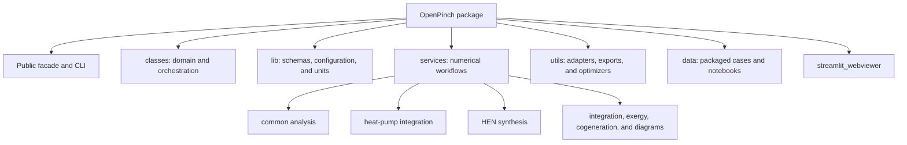

# Code Structure

## Build System

- **Type**: PEP 517 Python package using Hatchling.
- **Configuration**: `pyproject.toml` defines package metadata, runtime and optional dependencies, dev dependencies, build inclusion rules, Ruff, and Black.
- **Environment management**: uv with a committed `uv.lock` and Python 3.14.2 selected by `.python-version`.
- **Tests**: pytest configured by `pytest.ini`; coverage is executed explicitly in CI.
- **Documentation**: Sphinx via `scripts/build_docs.py`.
- **Distribution**: `scripts/build_dist.py` builds wheel and sdist and performs package-content checks.
- **Release**: GitHub Actions validates tags, builds and smoke-tests artifacts, publishes to TestPyPI, then publishes to PyPI after environment approval.

## Module Hierarchy

Text alternative: the root package exposes facades and contains domain classes, shared schemas/configuration, analysis services, utilities, packaged data, and a Streamlit viewer. Services split into common operations, HPR, HEN synthesis, and specialized target families.

## Design Patterns

### Facade

- **Location**: package root, `PinchProblem`, `PinchWorkspace`, and `pinch_analysis_service`.
- **Purpose**: present curated workflows over a large numerical subsystem.
- **Implementation**: wrapper methods and accessors dispatch to prepared service functions and convert results into supported schemas.

### Descriptor-backed capability accessors

- **Location**: `classes/_problem/_target_accessor.py`, `_plot_accessor.py`, `_component_accessor.py`, and `_design_accessor.py`.
- **Purpose**: organize target, plot, component, and design methods without placing every method directly on `PinchProblem`.
- **Implementation**: descriptor objects bind a problem instance to specialized accessor classes.

### Service layer

- **Location**: `services/services_entry.py` and specialized service packages.
- **Purpose**: keep domain calculations callable independently of user-interface wrappers.
- **Implementation**: functions receive a prepared `Zone`, mutate or enrich it, and return the zone.

### Schema boundary

- **Location**: `lib/schemas`.
- **Purpose**: validate external I/O and preserve stable serializable results.
- **Implementation**: Pydantic models with field and model validators.

### Strategy and adapter

- **Location**: HPR targeting services, HEN targeting services, solver backends, black-box optimizers, and file-loading adapters.
- **Purpose**: select algorithms, solvers, or source formats behind common orchestration.
- **Implementation**: injected functions, method dispatch, task metadata, optional-dependency checks, and normalized result schemas.

### Composite

- **Location**: `Zone` and `ZoneTreeSchema`.
- **Purpose**: represent nested process, site, community, and region analysis boundaries.
- **Implementation**: recursive subzone storage with post-order and aggregate targeting.

### Value object with units

- **Location**: `classes/value.py` and `lib/unit_system.py`.
- **Purpose**: keep dimensional meaning attached to scalar, array, and period-valued data.
- **Implementation**: Pint-backed conversion and arithmetic plus output-unit policy.

### Repository-like workspace

- **Location**: `PinchWorkspace`.
- **Purpose**: manage named normalized inputs, workflows, cached views, and persistence.
- **Implementation**: defensive copies, case materialization, invalidation, and JSON bundles.

## Critical Dependencies

- **Pint** - unit correctness is foundational across domain and reporting models.
- **Pydantic** - external and persisted contracts rely on validation and serialization behavior.
- **CoolProp** - advanced fluid-property and vapour-compression calculations depend on its state solver.
- **NumPy, pandas, and SciPy** - numerical arrays, tables, interpolation, and optimization.
- **Optional solver stack** - HEN synthesis behavior depends on Pyomo, GEKKO, IDAES, and locally installed binaries.
- **Optional presentation stack** - Plotly, Streamlit, openpyxl, and pyxlsb support non-core surfaces.

## Existing Source Files Inventory

The inventory below lists every tracked Python source module under `OpenPinch` at analysis time. Package data notebooks and JSON samples are documented separately in the component inventory.

- `/etc/zshenv:2: operation not permitted: ps` - Module for zshenv:2: operation not permitted: ps.
- `/etc/zshenv:2: operation not permitted: ps` - Module for zshenv:2: operation not permitted: ps.
- `/etc/zshenv:2: operation not permitted: ps` - Module for zshenv:2: operation not permitted: ps.
- `/etc/zshenv:2: operation not permitted: ps` - Module for zshenv:2: operation not permitted: ps.
- `OpenPinch/__init__.py` - Package marker and curated local exports.
- `OpenPinch/__main__.py` - Command-line notebook resource copier.
- `OpenPinch/classes/__init__.py` - Package marker and curated local exports.
- `OpenPinch/classes/_problem/__init__.py` - Package marker and curated local exports.
- `OpenPinch/classes/_problem/_component_accessor.py` - PinchProblem helper for component accessor.
- `OpenPinch/classes/_problem/_design_accessor.py` - PinchProblem helper for design accessor.
- `OpenPinch/classes/_problem/_loading.py` - PinchProblem helper for loading.
- `OpenPinch/classes/_problem/_multiperiod.py` - PinchProblem helper for multiperiod.
- `OpenPinch/classes/_problem/_output.py` - PinchProblem helper for output.
- `OpenPinch/classes/_problem/_plot_accessor.py` - PinchProblem helper for plot accessor.
- `OpenPinch/classes/_problem/_result_extraction.py` - PinchProblem helper for result extraction.
- `OpenPinch/classes/_problem/_target_accessor.py` - PinchProblem helper for target accessor.
- `OpenPinch/classes/_problem/_target_dispatch.py` - PinchProblem helper for target dispatch.
- `OpenPinch/classes/_problem/_target_plan.py` - PinchProblem helper for target plan.
- `OpenPinch/classes/_problem/_validation.py` - PinchProblem helper for validation.
- `OpenPinch/classes/_problem_table/__init__.py` - Package marker and curated local exports.
- `OpenPinch/classes/_problem_table/_equality.py` - Problem-table support for equality.
- `OpenPinch/classes/_problem_table/_problem_table_constants.py` - Problem-table support for problem table constants.
- `OpenPinch/classes/_stream_collection/__init__.py` - Package marker and curated local exports.
- `OpenPinch/classes/_stream_collection/_helpers.py` - Stream-collection support for helpers.
- `OpenPinch/classes/_stream_collection/_numeric_view.py` - Stream-collection support for numeric view.
- `OpenPinch/classes/_workspace/__init__.py` - Package marker and curated local exports.
- `OpenPinch/classes/_workspace/case_inputs.py` - PinchWorkspace helper for case inputs.
- `OpenPinch/classes/_workspace/execution.py` - PinchWorkspace helper for execution.
- `OpenPinch/classes/_workspace/views.py` - PinchWorkspace helper for views.
- `OpenPinch/classes/heat_exchanger.py` - Domain or orchestration model for heat exchanger.
- `OpenPinch/classes/heat_exchanger_network.py` - Domain or orchestration model for heat exchanger network.
- `OpenPinch/classes/pinch_problem.py` - Domain or orchestration model for pinch problem.
- `OpenPinch/classes/pinch_workspace.py` - Domain or orchestration model for pinch workspace.
- `OpenPinch/classes/problem_table.py` - Domain or orchestration model for problem table.
- `OpenPinch/classes/stream.py` - Domain or orchestration model for stream.
- `OpenPinch/classes/stream_collection.py` - Domain or orchestration model for stream collection.
- `OpenPinch/classes/value.py` - Domain or orchestration model for value.
- `OpenPinch/classes/zone.py` - Domain or orchestration model for zone.
- `OpenPinch/data/__init__.py` - Package marker and curated local exports.
- `OpenPinch/data/notebooks/__init__.py` - Package marker and curated local exports.
- `OpenPinch/data/sample_cases/__init__.py` - Package marker and curated local exports.
- `OpenPinch/lib/__init__.py` - Package marker and curated local exports.
- `OpenPinch/lib/config.py` - Shared configuration, enum, unit, or type support for config.
- `OpenPinch/lib/config_metadata.py` - Shared configuration, enum, unit, or type support for config metadata.
- `OpenPinch/lib/coolprop_fluids.py` - Shared configuration, enum, unit, or type support for coolprop fluids.
- `OpenPinch/lib/enums.py` - Shared configuration, enum, unit, or type support for enums.
- `OpenPinch/lib/heat_exchanger_network_types.py` - Shared configuration, enum, unit, or type support for heat exchanger network types.
- `OpenPinch/lib/problem_table_types.py` - Shared configuration, enum, unit, or type support for problem table types.
- `OpenPinch/lib/schemas/__init__.py` - Package marker and curated local exports.
- `OpenPinch/lib/schemas/common.py` - Pydantic schema definitions for common.
- `OpenPinch/lib/schemas/graphs.py` - Pydantic schema definitions for graphs.
- `OpenPinch/lib/schemas/hpr.py` - Pydantic schema definitions for hpr.
- `OpenPinch/lib/schemas/io.py` - Pydantic schema definitions for io.
- `OpenPinch/lib/schemas/report_units.py` - Pydantic schema definitions for report units.
- `OpenPinch/lib/schemas/reporting.py` - Pydantic schema definitions for reporting.
- `OpenPinch/lib/schemas/synthesis/__init__.py` - Package marker and curated local exports.
- `OpenPinch/lib/schemas/synthesis/methods.py` - HEN synthesis schema compatibility module for methods.
- `OpenPinch/lib/schemas/synthesis/results.py` - HEN synthesis schema compatibility module for results.
- `OpenPinch/lib/schemas/synthesis/tasks.py` - HEN synthesis schema compatibility module for tasks.
- `OpenPinch/lib/schemas/targets.py` - Pydantic schema definitions for targets.
- `OpenPinch/lib/schemas/turbine.py` - Pydantic schema definitions for turbine.
- `OpenPinch/lib/schemas/workspace.py` - Pydantic schema definitions for workspace.
- `OpenPinch/lib/unit_system.py` - Shared configuration, enum, unit, or type support for unit system.
- `OpenPinch/main.py` - Typed TargetInput-to-TargetOutput service facade.
- `OpenPinch/resources.py` - Packaged sample-case and notebook discovery and copying.
- `OpenPinch/services/__init__.py` - Package marker and curated local exports.
- `OpenPinch/services/common/__init__.py` - Package marker and curated local exports.
- `OpenPinch/services/common/capital_cost_and_area_targeting.py` - Shared analysis service for capital cost and area targeting.
- `OpenPinch/services/common/gcc_manipulation.py` - Shared analysis service for gcc manipulation.
- `OpenPinch/services/common/graph_data.py` - Shared analysis service for graph data.
- `OpenPinch/services/common/graph_series_meta.py` - Shared analysis service for graph series meta.
- `OpenPinch/services/common/miscellaneous.py` - Shared analysis service for miscellaneous.
- `OpenPinch/services/common/problem_table_analysis.py` - Shared analysis service for problem table analysis.
- `OpenPinch/services/common/service_orchestration.py` - Shared analysis service for service orchestration.
- `OpenPinch/services/common/temperature_driving_force.py` - Shared analysis service for temperature driving force.
- `OpenPinch/services/common/utility_targeting.py` - Shared analysis service for utility targeting.
- `OpenPinch/services/components/__init__.py` - Package marker and curated local exports.
- `OpenPinch/services/components/direct_mvr/__init__.py` - Package marker and curated local exports.
- `OpenPinch/services/components/direct_mvr/direct_gas_mvr.py` - Specialized analysis service for direct gas mvr.
- `OpenPinch/services/components/process_components.py` - Specialized analysis service for process components.
- `OpenPinch/services/components/process_mvr.py` - Specialized analysis service for process mvr.
- `OpenPinch/services/direct_heat_integration/__init__.py` - Package marker and curated local exports.
- `OpenPinch/services/direct_heat_integration/direct_integration_entry.py` - Specialized analysis service for direct integration entry.
- `OpenPinch/services/energy_transfer_analysis/__init__.py` - Package marker and curated local exports.
- `OpenPinch/services/energy_transfer_analysis/energy_transfer_entry.py` - Specialized analysis service for energy transfer entry.
- `OpenPinch/services/exergy_analysis/__init__.py` - Package marker and curated local exports.
- `OpenPinch/services/exergy_analysis/exergy_targeting_entry.py` - Specialized analysis service for exergy targeting entry.
- `OpenPinch/services/heat_exchanger_network_controllability/__init__.py` - Package marker and curated local exports.
- `OpenPinch/services/heat_exchanger_network_controllability/models.py` - Specialized analysis service for models.
- `OpenPinch/services/heat_exchanger_network_controllability/service.py` - Specialized analysis service for service.
- `OpenPinch/services/heat_exchanger_network_synthesis/__init__.py` - Package marker and curated local exports.
- `OpenPinch/services/heat_exchanger_network_synthesis/common/__init__.py` - Package marker and curated local exports.
- `OpenPinch/services/heat_exchanger_network_synthesis/common/errors.py` - HEN synthesis orchestration or shared support for errors.
- `OpenPinch/services/heat_exchanger_network_synthesis/common/execution/__init__.py` - Package marker and curated local exports.
- `OpenPinch/services/heat_exchanger_network_synthesis/common/execution/executor.py` - HEN workflow execution support for executor.
- `OpenPinch/services/heat_exchanger_network_synthesis/common/execution/fake_executor.py` - HEN workflow execution support for fake executor.
- `OpenPinch/services/heat_exchanger_network_synthesis/common/execution/fallbacks.py` - HEN workflow execution support for fallbacks.
- `OpenPinch/services/heat_exchanger_network_synthesis/common/execution/pathways.py` - HEN workflow execution support for pathways.
- `OpenPinch/services/heat_exchanger_network_synthesis/common/execution/settings.py` - HEN workflow execution support for settings.
- `OpenPinch/services/heat_exchanger_network_synthesis/common/execution/task_builders.py` - HEN workflow execution support for task builders.
- `OpenPinch/services/heat_exchanger_network_synthesis/common/indexing.py` - HEN synthesis orchestration or shared support for indexing.
- `OpenPinch/services/heat_exchanger_network_synthesis/common/reporting/__init__.py` - Package marker and curated local exports.
- `OpenPinch/services/heat_exchanger_network_synthesis/common/reporting/exports.py` - HEN reporting support for exports.
- `OpenPinch/services/heat_exchanger_network_synthesis/common/reporting/ranking.py` - HEN reporting support for ranking.
- `OpenPinch/services/heat_exchanger_network_synthesis/common/reporting/verification.py` - HEN reporting support for verification.
- `OpenPinch/services/heat_exchanger_network_synthesis/common/results/__init__.py` - Package marker and curated local exports.
- `OpenPinch/services/heat_exchanger_network_synthesis/common/results/assembly.py` - HEN result assembly support for assembly.
- `OpenPinch/services/heat_exchanger_network_synthesis/common/results/seeds.py` - HEN result assembly support for seeds.
- `OpenPinch/services/heat_exchanger_network_synthesis/common/service_context.py` - HEN synthesis orchestration or shared support for service context.
- `OpenPinch/services/heat_exchanger_network_synthesis/common/solver/__init__.py` - Package marker and curated local exports.
- `OpenPinch/services/heat_exchanger_network_synthesis/common/solver/arrays.py` - HEN solver adapter or transformation for arrays.
- `OpenPinch/services/heat_exchanger_network_synthesis/common/solver/backend.py` - HEN solver adapter or transformation for backend.
- `OpenPinch/services/heat_exchanger_network_synthesis/common/solver/dependencies.py` - HEN solver adapter or transformation for dependencies.
- `OpenPinch/services/heat_exchanger_network_synthesis/common/solver/extraction.py` - HEN solver adapter or transformation for extraction.
- `OpenPinch/services/heat_exchanger_network_synthesis/common/solver/pinch_design_decomposition.py` - HEN solver adapter or transformation for pinch design decomposition.
- `OpenPinch/services/heat_exchanger_network_synthesis/heat_exchanger_network_synthesis_entry.py` - HEN synthesis orchestration or shared support for heat exchanger network synthesis entry.
- `OpenPinch/services/heat_exchanger_network_synthesis/targeting_services/__init__.py` - Package marker and curated local exports.
- `OpenPinch/services/heat_exchanger_network_synthesis/targeting_services/network_evolution_method.py` - HEN synthesis method for network evolution method.
- `OpenPinch/services/heat_exchanger_network_synthesis/targeting_services/open_hens_method.py` - HEN synthesis method for open hens method.
- `OpenPinch/services/heat_exchanger_network_synthesis/targeting_services/pinch_design_method.py` - HEN synthesis method for pinch design method.
- `OpenPinch/services/heat_exchanger_network_synthesis/targeting_services/thermal_derivative_method.py` - HEN synthesis method for thermal derivative method.
- `OpenPinch/services/heat_exchanger_network_synthesis/targeting_services/topology.py` - HEN synthesis method for topology.
- `OpenPinch/services/heat_exchanger_network_synthesis/unit_models/__init__.py` - Package marker and curated local exports.
- `OpenPinch/services/heat_exchanger_network_synthesis/unit_models/base.py` - HEN optimization model for base.
- `OpenPinch/services/heat_exchanger_network_synthesis/unit_models/packed_pinch_design.py` - HEN optimization model for packed pinch design.
- `OpenPinch/services/heat_exchanger_network_synthesis/unit_models/packed_stagewise.py` - HEN optimization model for packed stagewise.
- `OpenPinch/services/heat_exchanger_network_synthesis/unit_models/pinch_design.py` - HEN optimization model for pinch design.
- `OpenPinch/services/heat_exchanger_network_synthesis/unit_models/problem.py` - HEN optimization model for problem.
- `OpenPinch/services/heat_exchanger_network_synthesis/unit_models/stage_packing.py` - HEN optimization model for stage packing.
- `OpenPinch/services/heat_exchanger_network_synthesis/unit_models/stagewise.py` - HEN optimization model for stagewise.
- `OpenPinch/services/heat_pump_integration/__init__.py` - Package marker and curated local exports.
- `OpenPinch/services/heat_pump_integration/common/__init__.py` - Package marker and curated local exports.
- `OpenPinch/services/heat_pump_integration/common/_shared/__init__.py` - Package marker and curated local exports.
- `OpenPinch/services/heat_pump_integration/common/_shared/ambient_preallocation.py` - HPR preprocessing, encoding, or shared support for ambient preallocation.
- `OpenPinch/services/heat_pump_integration/common/_shared/plotting.py` - HPR preprocessing, encoding, or shared support for plotting.
- `OpenPinch/services/heat_pump_integration/common/_shared/streams.py` - HPR preprocessing, encoding, or shared support for streams.
- `OpenPinch/services/heat_pump_integration/common/encoding.py` - HPR preprocessing, encoding, or shared support for encoding.
- `OpenPinch/services/heat_pump_integration/common/layout.py` - HPR preprocessing, encoding, or shared support for layout.
- `OpenPinch/services/heat_pump_integration/common/load_selection.py` - HPR preprocessing, encoding, or shared support for load selection.
- `OpenPinch/services/heat_pump_integration/common/postprocessing.py` - HPR preprocessing, encoding, or shared support for postprocessing.
- `OpenPinch/services/heat_pump_integration/common/preprocessing.py` - HPR preprocessing, encoding, or shared support for preprocessing.
- `OpenPinch/services/heat_pump_integration/common/shared.py` - HPR preprocessing, encoding, or shared support for shared.
- `OpenPinch/services/heat_pump_integration/heat_pump_and_refrigeration_entry.py` - HPR service orchestration for heat pump and refrigeration entry.
- `OpenPinch/services/heat_pump_integration/targeting_services/__init__.py` - Package marker and curated local exports.
- `OpenPinch/services/heat_pump_integration/targeting_services/brayton.py` - HPR targeting strategy for brayton.
- `OpenPinch/services/heat_pump_integration/targeting_services/cascade_carnot.py` - HPR targeting strategy for cascade carnot.
- `OpenPinch/services/heat_pump_integration/targeting_services/cascade_vapour_compression.py` - HPR targeting strategy for cascade vapour compression.
- `OpenPinch/services/heat_pump_integration/targeting_services/multiperiod.py` - HPR targeting strategy for multiperiod.
- `OpenPinch/services/heat_pump_integration/targeting_services/parallel_carnot.py` - HPR targeting strategy for parallel carnot.
- `OpenPinch/services/heat_pump_integration/targeting_services/parallel_vapour_compression.py` - HPR targeting strategy for parallel vapour compression.
- `OpenPinch/services/heat_pump_integration/targeting_services/vapour_compression_mvr.py` - HPR targeting strategy for vapour compression mvr.
- `OpenPinch/services/heat_pump_integration/unit_models/__init__.py` - Package marker and curated local exports.
- `OpenPinch/services/heat_pump_integration/unit_models/brayton_heat_pump.py` - Thermodynamic unit model for brayton heat pump.
- `OpenPinch/services/heat_pump_integration/unit_models/carnot_cycles.py` - Thermodynamic unit model for carnot cycles.
- `OpenPinch/services/heat_pump_integration/unit_models/cascade_vapour_compression_cycle.py` - Thermodynamic unit model for cascade vapour compression cycle.
- `OpenPinch/services/heat_pump_integration/unit_models/mechanical_vapour_recompression_cycle.py` - Thermodynamic unit model for mechanical vapour recompression cycle.
- `OpenPinch/services/heat_pump_integration/unit_models/parallel_vapour_compression_cycles.py` - Thermodynamic unit model for parallel vapour compression cycles.
- `OpenPinch/services/heat_pump_integration/unit_models/vapour_compression_cycle.py` - Thermodynamic unit model for vapour compression cycle.
- `OpenPinch/services/heat_pump_integration/unit_models/vapour_compression_mvr_cascade.py` - Thermodynamic unit model for vapour compression mvr cascade.
- `OpenPinch/services/indirect_heat_integration/__init__.py` - Package marker and curated local exports.
- `OpenPinch/services/indirect_heat_integration/indirect_integration_entry.py` - Specialized analysis service for indirect integration entry.
- `OpenPinch/services/input_data_processing/__init__.py` - Package marker and curated local exports.
- `OpenPinch/services/input_data_processing/_canonicalization.py` - Specialized analysis service for canonicalization.
- `OpenPinch/services/input_data_processing/_utility_preparation.py` - Specialized analysis service for utility preparation.
- `OpenPinch/services/input_data_processing/data_preparation.py` - Specialized analysis service for data preparation.
- `OpenPinch/services/network_grid_diagram/__init__.py` - Package marker and curated local exports.
- `OpenPinch/services/network_grid_diagram/_dependencies.py` - Network-grid diagram support for dependencies.
- `OpenPinch/services/network_grid_diagram/builder.py` - Network-grid diagram support for builder.
- `OpenPinch/services/network_grid_diagram/constants.py` - Network-grid diagram support for constants.
- `OpenPinch/services/network_grid_diagram/models.py` - Network-grid diagram support for models.
- `OpenPinch/services/network_grid_diagram/renderer.py` - Network-grid diagram support for renderer.
- `OpenPinch/services/network_grid_diagram/service.py` - Network-grid diagram support for service.
- `OpenPinch/services/power_cogeneration/__init__.py` - Package marker and curated local exports.
- `OpenPinch/services/power_cogeneration/power_cogeneration_entry.py` - Specialized analysis service for power cogeneration entry.
- `OpenPinch/services/power_cogeneration/unit_models/multi_stage_steam_turbine.py` - Specialized analysis service for multi stage steam turbine.
- `OpenPinch/services/services_entry.py` - Specialized analysis service for services entry.
- `OpenPinch/streamlit_webviewer/web_graphing.py` - Streamlit presentation support for web graphing.
- `OpenPinch/utils/__init__.py` - Package marker and curated local exports.
- `OpenPinch/utils/_tabular_input.py` - Adapter or utility for tabular input.
- `OpenPinch/utils/bb_optimisers/__init__.py` - Package marker and curated local exports.
- `OpenPinch/utils/bb_optimisers/bayesian_optimisation.py` - Black-box optimization backend for bayesian optimisation.
- `OpenPinch/utils/bb_optimisers/cmaes.py` - Black-box optimization backend for cmaes.
- `OpenPinch/utils/bb_optimisers/common.py` - Black-box optimization backend for common.
- `OpenPinch/utils/bb_optimisers/dual_annealing.py` - Black-box optimization backend for dual annealing.
- `OpenPinch/utils/bb_optimisers/rbf_surrogate.py` - Black-box optimization backend for rbf surrogate.
- `OpenPinch/utils/blackbox_minimisers.py` - Adapter or utility for blackbox minimisers.
- `OpenPinch/utils/costing.py` - Adapter or utility for costing.
- `OpenPinch/utils/csv_to_json.py` - Adapter or utility for csv to json.
- `OpenPinch/utils/decorators.py` - Adapter or utility for decorators.
- `OpenPinch/utils/export.py` - Adapter or utility for export.
- `OpenPinch/utils/heat_exchanger.py` - Adapter or utility for heat exchanger.
- `OpenPinch/utils/input_validation.py` - Adapter or utility for input validation.
- `OpenPinch/utils/optional_dependencies.py` - Adapter or utility for optional dependencies.
- `OpenPinch/utils/plots.py` - Adapter or utility for plots.
- `OpenPinch/utils/stream_linearisation.py` - Adapter or utility for stream linearisation.
- `OpenPinch/utils/value_resolution.py` - Adapter or utility for value resolution.
- `OpenPinch/utils/water_properties.py` - Adapter or utility for water properties.
- `OpenPinch/utils/wkbook_to_json.py` - Adapter or utility for wkbook to json.

