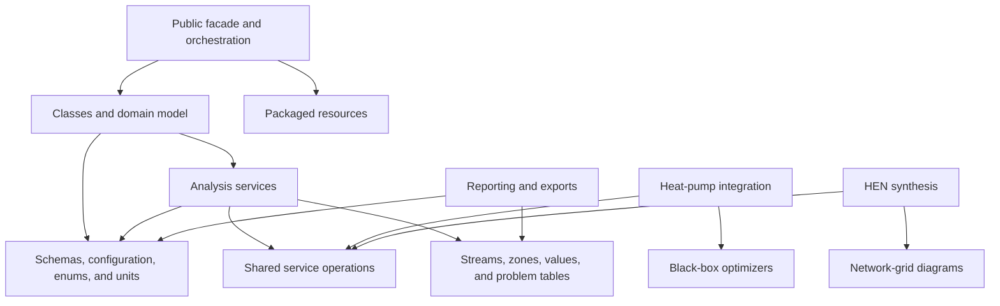

# Dependencies

## Internal Dependencies

Text alternative: public facades depend on domain classes, schemas, services, and resources. Specialized HPR and HEN services depend on shared service operations, domain objects, configuration, optimizers, and diagram/reporting components.

### Dependency Direction Notes

- `OpenPinch.__init__` intentionally curates the public surface and imports orchestration, schemas, resources, and selected utilities.
- `PinchProblem` is the main dependency hub: it imports schemas, resource and file adapters, service entry points, reporting helpers, and dashboard presentation.
- The service layer generally depends on domain objects and `lib`; runtime target schemas also depend on selected domain classes, creating a deliberately intertwined domain/schema layer.
- Optional synthesis imports are lazy behind `OpenPinch.services` and explicit dependency checks so base installs can import without solver packages.
- Presentation and export code sits above solved domain state, although `PinchProblem` directly imports Streamlit viewer functions, making presentation part of the orchestration module dependency graph.

## External Dependencies

### Core runtime

- **NumPy `<3`** - numerical arrays and vectorized calculations; installed version 2.4.6; BSD-family license.
- **pandas `<3`** - tables, summaries, comparisons, and serialization; installed version 2.3.3; BSD-3-Clause.
- **Pint `<1`** - dimensional values and conversion; installed version 0.25.3; BSD-family license.
- **CoolProp `<8`** - thermophysical property calculations; installed version inspected through package metadata.
- **Pydantic `<3`** - schemas and validation; installed through the locked environment; MIT.
- **SciPy `<2`** - interpolation and optimization; installed through the locked environment; BSD-family components.

### Optional runtime

- **Streamlit** - dashboard; installed version 1.58.0; Apache-2.0.
- **Plotly** - graphing; installed version 6.8.0; MIT.
- **openpyxl** - XLSX I/O; installed version 3.1.5; MIT.
- **pyxlsb** - XLSB input; installed version 1.0.10; LGPLv3+.
- **TESPy** - optional Brayton-cycle models; installed version 0.10.1.post2.
- **Pyomo** - algebraic optimization models; installed version 6.10.1; BSD-3-Clause.
- **GEKKO** - optimization backend; installed version 1.3.2; MIT.
- **Kaleido** - Plotly image export; installed version 1.3.0; MIT.
- **wakepy** - long-run wake lock; installed version 1.0.0; MIT.
- **IDAES-PSE** - process-systems optimization stack and solver integration; installed version 2.11.0; BSD.

### Development and delivery

- pytest 9.1.1, Coverage.py, Ruff 0.15.18, Sphinx 9.1.0, Hatchling 1.30.1, Black, Pylint, Graphviz, nbformat, and build tooling.
- GitHub Actions dependencies are pinned to immutable commit SHAs.

## Dependency Management Characteristics

- `uv.lock` provides a reproducible development resolution and matches project version 0.4.5.
- Published runtime requirements use broad upper bounds rather than exact pins, appropriate for a library but leaving compatibility assurance to CI and release testing.
- Most optional dependencies have minimum versions or no bounds; cross-product compatibility is sampled by optional-install smoke jobs rather than a formal supported-version matrix.
- External optimization binaries are not installed by the package and must be provisioned separately.
- No automated dependency vulnerability or license-policy job was found in the three GitHub Actions workflows.

