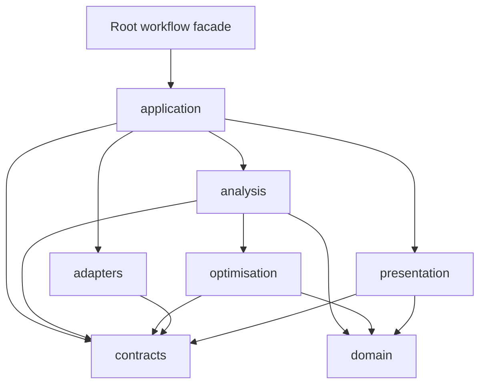

# Dependencies

## Internal Dependency Direction

Text alternative: the root facade depends on application orchestration.
Application coordinates contracts, adapters, analysis, and presentation.
Analysis and optimisation point inward to domain and contracts; adapters and
presentation use contracts at their respective boundaries.

### Enforced Direction Notes

- `OpenPinch.domain` cannot import application, presentation, or concrete
  optimisation backends.
- `OpenPinch.contracts` cannot import application or presentation.
- `OpenPinch.analysis` cannot import application or presentation.
- `OpenPinch.application` cannot import concrete UI, plotting, filesystem, or
  solver-backend packages at module import time; feature boundaries are lazy or
  delegated.
- `OpenPinch.optimisation` provides shared abstractions so analysis families do
  not depend on one another for candidate or execution types.
- Package marker modules remain lightweight; advanced dependencies are guarded
  where their features are invoked.

## Core Runtime Dependencies

- **NumPy** for numerical arrays and vectorized calculations.
- **pandas** for tables, summaries, comparisons, and serialization.
- **Pint** for units and dimensional conversion.
- **CoolProp** for thermophysical properties.
- **Pydantic** for strict transport and persistence contracts.
- **SciPy** for interpolation and optimization.

## Optional Runtime Dependencies

- **Plotly, Kaleido, and Streamlit** for graphing, export, and dashboards.
- **openpyxl and pyxlsb** for workbook output and legacy input.
- **TESPy** for optional Brayton-cycle thermodynamics.
- **Pyomo, GEKKO, and IDAES-PSE** for HEN optimisation and solver integration.
- **wakepy** for optional wake locking during long local synthesis runs.
- **Jupyter/nbformat** for tutorial execution profiles.

Optional dependencies are feature guards, not compatibility fallbacks. Missing
packages produce focused installation guidance; base package import does not
require the optional stack.

## Development and Delivery Dependencies

- pytest and Hypothesis for deterministic unit, contract, and property tests.
- Ruff for linting and formatting.
- Sphinx and the Read the Docs theme for documentation.
- Hatchling and build tooling for wheel/source archives.
- GitHub Actions for CI and trusted PyPI publishing.

## External Systems

OpenPinch calls no required network service and stores no data in a database.
External solver binaries are provisioned separately and are invoked only by
explicit solver-backed workflows. The OpenHENS comparison utility verifies and
temporarily isolates the exact requested source checkout before executing its
factory.
