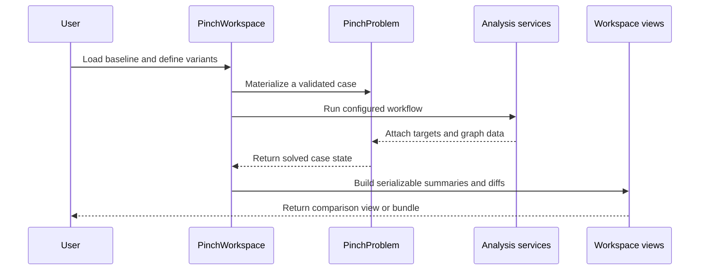
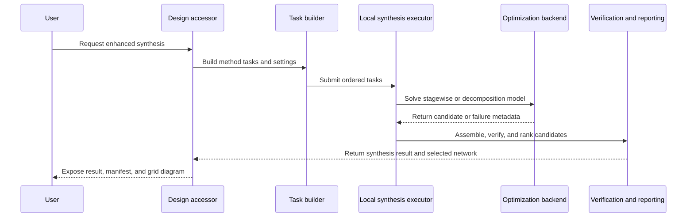
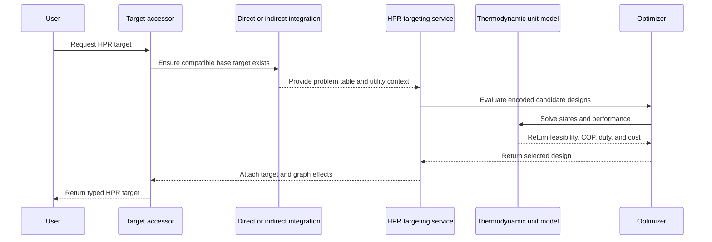

# Interaction Diagrams

## Scenario Comparison

Text alternative: a workspace stores baseline and variant inputs, materializes each as a problem, runs services, and converts solved problems into serializable comparison views or bundles.

## Heat-Exchanger-Network Synthesis

Text alternative: the design accessor builds synthesis tasks, executes optional solver backends, then verifies, ranks, and returns candidate networks and reports.

## Heat-Pump or Refrigeration Targeting

Text alternative: HPR targeting first ensures a compatible heat-integration target, then an optimizer evaluates thermodynamic unit models and returns the selected design and its graph effects.

